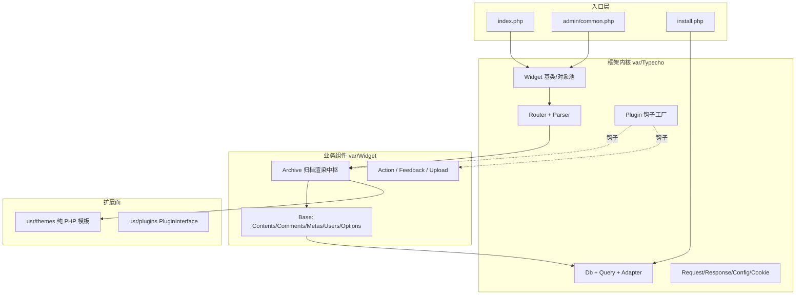
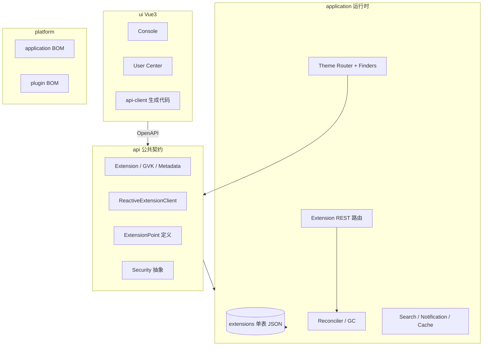

# Typecho & Halo 技术分析报告

> 分析对象：`docs/typecho`（Typecho 1.3.x）、`docs/halo`（Halo 2.x monorepo）  
> 目的：为「轻量级、可部署于 Cloudflare Workers 的博客系统」提供架构基底与功能借鉴依据。  
> 说明：本报告仅作技术分析与选型输入，不包含对原项目代码的复用承诺。

---

## 1. 结论摘要

| 维度 | Typecho | Halo | 对新系统的启示 |
|------|---------|------|----------------|
| 形态 | 单体 PHP 博客引擎 | Java 建站/CMS 平台 | 新系统宜偏「引擎」而非「平台」 |
| 分层 | 入口 → Router → Widget → Db | api / application / ui / platform | 保留 Typecho 的轻分层，吸收 Halo 的契约意识 |
| 数据 | 7 表关系模型 | 单表 Extension + JSON 文档 | 关系表为主，标签/元数据做索引增强 |
| 扩展 | 插件钩子 + 主题 PHP 模板 | Extension + ExtensionPoint + Reconciler | 钩子/过滤器足够；完整 K8s 模型偏重 |
| 部署 | 传统 LAMP/虚拟主机 | Docker + JVM | Workers 无状态运行时更适合 Typecho 轻量基因 |

**倾向性判断**：以 Typecho 的「小内核 + Widget/钩子 + 主题模板」为骨架较契合轻量博客定位；Halo 在数据模型表达力、配置契约、内容版本、扩展点声明等方面的思路值得择要整合。完整移植 Halo 的 Extension/Reconciler/类加载插件体系，在 Workers 环境通常成本偏高。

---

## 2. Typecho 技术架构

### 2.1 整体分层



请求生命周期（简化）：

1. `index.php` 加载配置 → `Widget\Init` 初始化 → `Plugin begin` 钩子 → `Router::dispatch()`
2. 路由表（存于 options）由 `Router\Parser` 将 `/archives/[cid:digital]/` 等模式编译为正则
3. 匹配到 `{widget, action}` 后实例化 Widget，调用 `render` / 自定义 action
4. `Archive` 按内容类型分发到 index/single/category/tag/author/date/search 处理器
5. 模板按约定链选择文件并 `require`，输出前可被插件 `filter` 改写

关键证据：`index.php:11-26`、`var/Typecho/Router.php:46-104`、`var/Widget/Archive.php:531-696,1315-1393`、`var/Widget/Init.php:33-118`。

### 2.2 功能模块地图

| 模块 | 职责要点 |
|------|----------|
| 内容 | post/page/attachment/revision 统一存 `contents`；Markdown 前缀标记；自定义字段 `fields` |
| 分类/标签 | `metas` 共表（type=category\|tag）+ `relationships` 多对多 + `TreeTrait` 分类树 |
| 评论 | `Feedback` 统一 comment/trackback；嵌套 `parent`；状态 approved/spam |
| 用户 | `users` 角色 visitor→administrator；密码兼容 phpass/现代 hash |
| 配置 | `options` 全局 + 用户级；序列化存储 routingTable / plugins / theme 配置 |
| 插件 | `PluginInterface` 四方法；`factory()->on/call/filter`；权重排序 |
| 主题 | 模板约定链 + `functions.php`（themeConfig/themeInit）+ Archive 输出 API |
| 其他 | Feed、备份、升级、I18n、Security 验证码、XML-RPC 全家桶 |

### 2.3 数据模型（`install/Mysql.sql`）

```
contents(cid PK, slug UNIQUE, title, created, modified, text, type, status,
         password, commentsNum, allowComment/Ping/Feed, parent, template, order, authorId)
comments(coid PK, cid FK, created, author, authorId, ownerId, mail, url, ip, agent,
         text, type, status, parent)
metas(mid PK, name, slug, type(category|tag), description, count, order, parent)
relationships(cid, mid)  -- 复合 PK
fields(cid, name, type(str|int|float|json), str_value, int_value, float_value)
options(name, user, value)  -- 复合 PK
users(uid PK, name UNIQUE, password, mail UNIQUE, url, screenName, group, authCode, ...)
```

设计特点：

- **单表多态**：contents 用 `type` 区分文章/页面/附件/修订，减少表数量
- **分类标签共表**：metas + type，分类树用 `parent` 自引用
- **自定义字段分列存储**：按类型落到 str/int/float 列，便于索引
- **配置即数据**：路由表、插件列表都进 options，安装后可运行时改

### 2.4 插件与主题

- 插件契约：`activate / deactivate / config / personalConfig`（`PluginInterface.php`）
- 钩子：`Plugin::factory('组件')->on('prop') = fn`；`call()` 副作用、`filter()` 管道改值
- 主题：`Archive::render()` 按 `自定义template → type/slug.php → type.php → single/archive → index.php` 回落
- 模板内 `$this` 即 Widget，`next()/content()/permalink()` 等直接输出

### 2.5 可移植性评估

| 倾向 | 说明 |
|------|------|
| 较易剥离 | Db Adapter/Query、Markdown/HyperDown、PasswordHash、I18n、Feed、表单 Helper |
| 中等 | Widget/Base 实体层、插件钩子语义、路由表模式、模板约定 |
| 较难 | `Archive` 2100+ 行中枢、Options 三合一配置、静态全局态（Db::get / Request::getInstance） |

对新系统的启发：保留「路由表 + Widget/Handler + 钩子 + 模板约定」的轻量骨架；避免巨型单类与进程级单例，适配 Workers 的请求作用域。

---

## 3. Halo 技术架构

### 3.1 整体分层



模块职责：`api` 是插件与应用共享的兼容面；`application` 承载 WebFlux + R2DBC 业务；`ui` 为 Console/UC 前端；`platform` 管依赖约束。

### 3.2 核心设计：一切皆 Extension

- **元模型**：`@GVK(group, version, kind, plural)` + `Metadata`（name/labels/annotations/version/finalizers…）
- **统一存储**：单表 `extensions(name, data JSON, version)`，键形如 `/registry/{group}/{plural}/{name}`
- **CRUD + Watch**：`ReactiveExtensionClient` 提供 list/fetch/create/update/delete/watch，支持标签选择器
- **自动 REST**：按 Scheme 生成 `/apis/{group}/{version}/{plural}`
- **控制器**：Reconciler + RequestQueue + finalizer/GC，对齐 K8s 调和循环
- **查询**：内存 IndexedQueryEngine + 条件 DSL（Equal/In/Label/And/Or…）

扩展点以 YAML 声明（25+），插件用 `ExtensionDefinition` 绑定实现类；主题侧另有 Finder、head/footer 处理器、CommentWidget 等。

### 3.3 数据/领域模型要点

全部采用 **spec（期望态）+ status（观测态）** 双段式，关系以 name 引用为主、无外键：

| 实体 | 关键字段/能力 |
|------|----------------|
| Post | title/slug、release/head/base Snapshot 指针、visible、pinned、categories/tags、htmlMetas；label 索引 published/deleted/owner/archive-* |
| Snapshot | subjectRef、rawType、rawPatch/contentPatch（相对 base 的行 diff）、parentSnapshotName |
| Category | parent 引用式层级、preventParentPostCascadeQuery、hideFromList |
| Comment/Reply | subjectRef 多态挂载、游客 owner、approved/hidden/top |
| User | email/phone/password/TOTP、登录历史限制 |
| Setting / ConfigMap | 表单 schema 与配置值分离（FormKit 驱动） |
| Theme / Plugin | settingName + configMapName、requires、status.phase/entry |
| 其他 | Menu、Role/RoleBinding、Attachment+Policy、PAT、通知五件套、Counter |

### 3.4 主题 / 插件 / 平台能力

- **主题**：Thymeleaf + RouteFactory 家族 + Finder 注册表（Post/Category/Tag/Menu/Comment/Stats…）；`page-layout` 契约渐进增强（缺失回落内置布局并记诊断）
- **插件**：PF4J + Spring 子容器；生命周期由 `spec.enabled` 驱动 Reconciler
- **ESM UI 插件**：宿主 Import Map 提供共享运行时，插件不可覆盖核心模块
- **安全**：Basic/Form/PAT/OAuth2/邮箱验证码/TOTP/RememberMe/Device；RBAC 角色模板聚合
- **通知**：ReasonType → Reason → Subscription（SpEL 过滤）→ Notification/Template/Notifier
- **缓存**：页面缓存仅 GET/200/text/html，TTL 1 小时、上限 1 万条
- **搜索**：SearchEngine 扩展点，默认 Lucene，可换 Meilisearch/Algolia

### 3.5 适合借鉴 vs 不宜直搬

**建议借鉴**

1. Label/索引字段表达查询维度（published、archive-year 等）
2. Setting（表单）与 ConfigMap（值）分离，主题/插件配置数据化
3. 内容版本：base + patch 链，正文与元数据分离
4. 读写解耦：写入期望态，派生字段（permalink/摘要/计数）异步计算
5. 渐进式主题契约 + 诊断状态
6. 内容处理扩展点（版权/广告/Katex 注入）无需改主题
7. 评论 subjectRef 多态，便于页面/文章统一评论
8. OpenAPI 契约生成前端客户端

**通常不宜在 Workers 直接复刻**

- 长驻 JVM + PF4J 类加载热插拔
- 本地 Lucene 文件索引与内存全量索引引擎
- Reconciler/Watcher 常驻队列（Workers 需 Queue/Cron 外置）
- Thymeleaf + classloader 模板解析
- 多数据库方言迁移与 WebSocket 插件通道
- 完整 Spring Security 过滤器链

---

## 4. 对比与综合判断

### 4.1 架构哲学

| | Typecho | Halo |
|--|---------|------|
| 目标 | 博客引擎，开箱即写 | 建站平台，生态扩展 |
| 复杂度 | 低～中 | 高 |
| 扩展深度 | 钩子改行为 | 扩展点 + 控制器 + UI 插件 |
| 数据观 | 关系表清晰 | 文档 + 元数据高度灵活 |
| 运维面 | 虚拟主机友好 | Docker/服务器友好 |

### 4.2 新系统综合取向

1. **基底取 Typecho**：轻内核、路由表、Widget/Handler、主题模板约定、插件钩子——与 Serverless 冷启动、小包体目标一致。
2. **能力取 Halo 精选**：配置 schema 化、查询标签化、内容版本补丁链、派生状态、契约式主题能力、内容处理扩展点。
3. **不取 Halo 重型面**：完整 Extension 运行时、Reconciler 集群、JVM 插件隔离、本地搜索索引。

---

## 5. 证据索引（节选）

**Typecho**：`index.php`、`install/Mysql.sql`、`var/Typecho/Router.php`、`var/Typecho/Plugin.php`、`var/Typecho/Plugin/PluginInterface.php`、`var/Widget/Archive.php`、`var/Widget/Base/Contents.php`、`usr/themes/default/functions.php`、`usr/plugins/HelloWorld/Plugin.php`

**Halo**：`api/.../content/Post.java`、`api/.../content/Snapshot.java`、`api/.../content/Category.java`、`api/.../extension/*`、`application/.../store/ExtensionStore.java`、`application/src/main/resources/extensions/*`、`docs/extension-points/content.md`、`docs/cache/page.md`、`docs/developer-guide/page-layout.md`、`openspec/specs/ui-plugin-esm-runtime/spec.md`
