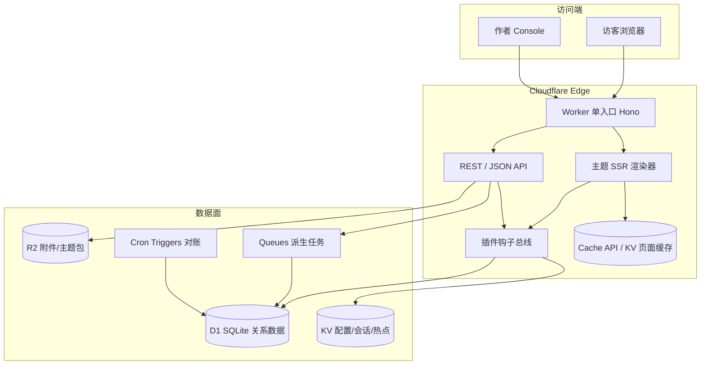

# 轻量级博客系统架构与技术栈设计

> 项目名称：**太平** / **Tai-Ping**（包名 `taiping-blog`）  
> 目标运行时：Cloudflare Workers（Serverless / Edge）  
> 架构基底：Typecho 轻量引擎思想  
> 能力增强：择要吸收 Halo 设计  
> 文档性质：整体架构规划 + 技术栈选型，供后续编码实现对照

## 0. 选型定稿（2026 确认）

| 决策点 | 定稿 | 说明 |
|--------|------|------|
| 后台形态 | **B. Vue3 SPA（Console）** | 独立构建，调用 JSON API；预留编辑器/插件 UI 扩展 |
| 前台主题 | **A. 轻量字符串模板** | 现以 zhuosu + `hono/html` 字符串模板落地（同属轻模板路线）；可另加 Eta 文件主题适配器 |
| 默认配色 | 橙 + 蓝 + 绿（暂定） | 后续收敛为「主色 / 强调 / 中性」；避免套路蓝紫 |
| 运行时栈 | TypeScript + Hono + D1 + KV/R2 + Queues/Cron | 维持既定 Workers 路径 |

---

## 1. 设计目标与边界

### 1.1 目标

1. **轻量**：单 Worker 入口可完成前台 SSR 与后台 API，冷启动可控，包体宜精简
2. **可部署 Cloudflare Workers**：主路径 D1 + KV + R2 + Queues/Cron，避免强依赖长驻进程
3. **Typecho 式可用性**：安装简单、主题可换、插件可挂、Markdown 写作优先
4. **Halo 式表达力（精选）**：配置表单化、查询标签化、内容版本、契约式主题、内容处理钩子

### 1.2 非目标（本期不优先）

- 多租户 SaaS / 商城 / 完整 CMS 工作流
- JVM 级插件热插拔与类加载隔离
- 本地 Lucene 全文索引引擎
- 完整 Halo Extension + Reconciler 运行时复刻

### 1.3 约束

| 约束 | 说明 |
|------|------|
| 运行时 | Workers 无文件系统、无常驻内存保证；状态外置 |
| 合规 | 不保留 typecho/halo 的 git 历史与代码拷贝，新仓从零实现 |
| 安全 | 密钥走环境变量/Workers Secrets，不硬编码 |
| 简洁 | 优先最小可运行闭环，再增量扩展 |

---

## 2. 总体架构

### 2.1 架构总览



### 2.2 分层（对齐 Typecho，替换运行时）

| Typecho 概念 | 新系统对应 | 说明 |
|--------------|------------|------|
| `index.php` | Worker `fetch` 入口 | 请求作用域容器，避免进程级单例 |
| `Typecho\Router` | Hono 路由 + 可选 DB 路由表 | 默认代码路由；自定义 permalink 模式可存 DB |
| `Widget\*` | `handlers/` + `services/` | 业务处理器，保持「一类一事」 |
| `Widget\Base\*` | `models/` + `repositories/` | 实体与持久化 |
| `Typecho\Plugin` | `plugins/` 钩子总线 | call/filter 语义对齐 Typecho |
| `usr/themes` | `themes/<id>` 模板 | 边缘可渲染模板（见选型） |
| `Typecho\Db` | D1 Repository 层 | 查询封装，禁止裸拼接用户输入 |
| `options` | `settings` + ConfigMap 风格 KV/表 | 借鉴 Halo Setting/ConfigMap 分离 |

### 2.3 请求生命周期

1. Worker 收到请求 → 组装 `AppContext`（env、db、kv、user、locale）
2. 中间件链：日志 → 安全头/CSRF → 会话鉴权 → 页面缓存查找
3. 路由命中 Handler（前台 Archive / 后台 Admin API）
4. Handler 经 Service/Repository 读 D1/KV，触发 `filter` 钩子
5. SSR 模板渲染（或 JSON 序列化），`beforeSend` 钩子后写入 Cache
6. 派生副作用（计数、通知、搜索索引）投递 Queue，不在请求内同步做完

---

## 3. 功能范围（MVP → 增强）

### 3.1 MVP（建议第一期）

| 域 | 能力 |
|----|------|
| 内容 | 文章/页面 CRUD、Markdown、草稿/发布、slug、摘要、封面 |
| 分类/标签 | 分类树、标签、关联、计数 |
| 评论 | 嵌套评论、审核、基础反垃圾（频率 + 可选 Turnstile） |
| 用户 | 单管理员 + 可选多作者；登录会话；角色粗粒度 |
| 主题 | 默认主题 + 模板约定 + 站点设置表单 |
| 配置 | 站点标题/描述/permalink/评论策略 |
| 输出 | RSS、sitemap、SEO meta、404 |
| 后台 | 列表/编辑/媒体/设置（可先 SPA 或服务端轻后台） |

### 3.2 增强（第二期+）

- 自定义字段（fields 风格）
- Snapshot 草稿版本/修订（可简化为全量 revision，再演进 patch）
- 插件包（ZIP + manifest）与更多钩子
- 全文搜索（D1 FTS5 或外接 Meilisearch/Algolia）
- 通知（邮件/Webhook，经 Queue）
- 图片策略/缩略图（R2 + Images 可选）
- PAT / OAuth 登录

---

## 4. 数据模型设计

### 4.1 原则

1. **以 Typecho 七表为骨架**（可读、可 SQL 迁移、贴合博客域）
2. **吸收 Halo 的索引标签与 spec/status 思想**（查询字段显式化、派生状态可重建）
3. **关系以整数/文本 ID 引用为主**，D1 无强外键时在应用层保证完整性
4. 时间戳建议 `TEXT`（ISO-8601）或 `INTEGER`（unix）二选一，全库统一

### 4.2 核心表（草案）

```text
posts
  id INTEGER PK
  type TEXT            -- post | page | attachment | revision
  title TEXT
  slug TEXT UNIQUE
  text TEXT            -- markdown 源文
  html TEXT            -- 渲染缓存（可重建）
  status TEXT          -- draft | published | private | hidden | waiting
  password TEXT NULL
  author_id INTEGER
  template TEXT NULL
  allow_comment INTEGER
  allow_ping INTEGER
  allow_feed INTEGER
  comments_num INTEGER
  pinned INTEGER
  order_num INTEGER
  parent INTEGER       -- revision/attachment 归属
  created_at / modified_at / published_at
  -- labels/索引列（借鉴 Halo）
  archive_year TEXT / archive_month TEXT
  visible TEXT         -- public | internal | private
  deleted INTEGER

comments
  id INTEGER PK
  post_id INTEGER
  parent INTEGER
  author / mail / url / ip / agent
  text TEXT
  status TEXT          -- approved | spam | waiting
  created_at

metas
  id INTEGER PK
  type TEXT            -- category | tag
  name / slug / description
  parent INTEGER       -- 分类树
  count INTEGER
  order_num INTEGER

relationships
  post_id, meta_id     -- PK

fields
  post_id, name, value_type, str_value, int_value, float_value, json_value

settings
  key TEXT PK          -- 站点/主题/插件配置
  scope TEXT           -- site | theme:<id> | plugin:<id> | user:<id>
  value TEXT           -- JSON

users
  id INTEGER PK
  name UNIQUE, email UNIQUE
  password_hash
  display_name, url, avatar
  role TEXT            -- admin | editor | author | subscriber
  created_at, last_login_at

-- 可选增强
revisions
  id, post_id, raw, created_at, author_id

sessions / tokens
  ...
```

### 4.3 Halo 思想落点

| Halo 概念 | 轻量落点 | 取舍说明 |
|-----------|----------|----------|
| metadata.labels | `posts` 上的 `status/visible/archive_*` 列 + 可选 `labels` JSON | D1 列查询通常比 JSON 扫更稳 |
| Setting + ConfigMap | `settings.scope` + 表单 schema（主题 `setting.json`） | 保留「表单与值分离」 |
| Snapshot patch 链 | MVP 用 `revisions` 全量；再评估 diff | patch 链省空间但实现复杂 |
| spec/status | 写入后由 Queue 回填 `html/comments_num/permalink` | 派生字段可重建 |
| subjectRef 评论 | 评论暂挂 post/page；字段预留 `subject_type` | 降低 MVP 复杂度 |
| Finder | 模板数据上下文对象 `themeContext` | 等价主题 API |

---

## 5. 核心模块设计

### 5.1 路由与前台渲染

- **默认**：代码路由（Hono）覆盖 index/post/category/tag/archive/search/feed/sitemap
- **自定义 permalink**：配置模式串 → 编译为匹配器（Typecho `Router\Parser` 思路），存 settings
- **模板选择链**（对齐 Typecho）：`custom template → type/slug → type → single/archive → index`

### 5.2 插件钩子总线（Typecho 语义）

```ts
type HookName =
  | 'app.begin' | 'app.end'
  | 'content.beforeSave' | 'content.afterRender' | 'content.filter'
  | 'comment.beforeCreate' | 'comment.filter'
  | 'theme.context' | 'response.beforeSend';

// call: 副作用；filter: 管道改值
plugin.on('content.filter', (html, ctx) => html, { weight: 10 });
```

插件形态建议：

| 方案 | 做法 | 利 | 弊 |
|------|------|----|----|
| A. 内置插件目录（推荐起步） | `src/plugins/*/index.ts` 编译进 Worker，settings 启停 | 无类加载问题、类型安全、部署简单 | 改插件需重新部署 |
| B. 外部插件（后期） | R2 存 JS 包 + 动态 import / Worker 拆分 | 热更新友好 | Workers 动态执行受限、版本与安全成本高 |

### 5.3 主题系统

- 目录：`themes/<id>/` 含 `theme.json`（元信息 + setting schema）、模板、静态资源
- 模板引擎候选见第 6 节；输出 API 对齐「模板里拿到 post/list/options/comments」
- **契约式能力**（Halo）：主题可声明 `supports: [layout, comment-widget, dark-mode]`，缺失时核心回落默认实现并记录兼容状态

### 5.4 评论与反垃圾

1. 服务端校验字段与频率（KV/D1 计数）
2. 可选 Cloudflare Turnstile
3. 审核策略：默认 `waiting` / 信任作者
4. 发送通知走 Queue，不阻塞 HTTP

### 5.5 缓存策略（Workers 原生）

| 层 | 用途 | 失效 |
|----|------|------|
| Cache API | 匿名 GET HTML 页 | 发布/改设置时按 tag 失效或短 TTL |
| KV | 热点列表、渲染片段、会话 | TTL + 主动删 |
| D1 | 真相源 | — |
| 内存 | 单请求内复用 | 请求结束即弃 |

建议规则对齐 Halo 页面缓存精神：仅缓存 GET + 200 + `text/html`，登录用户绕过。

### 5.6 后台 Console

| 方案 | 说明 | 利 | 弊 |
|------|------|----|----|
| A. 服务端轻后台（推荐 MVP） | 同 Worker 输出管理 HTML/HTMX | 零额外部署、体感像 Typecho | 交互上限低 |
| B. 独立 SPA（Vue/React） | `/console` 静态到 Pages/Assets | 交互强、接近 Halo | 构建链更重 |

---

## 6. 技术栈选型

### 6.1 运行时与语言

| 项 | 推荐 | 备选 | 理由 |
|----|------|------|------|
| 运行时 | Cloudflare Workers | Pages Functions | 单入口、Queues/Cron/D1 同生态 |
| 语言 | TypeScript | — | Workers 一等公民；类型利于契约 |
| HTTP 框架 | Hono | itty-router / 原生 | 轻、中间件模型清晰、Workers 生态常见 |
| 校验 | Zod | Valibot | 边界输入校验 |

### 6.2 数据存储

| 用途 | 推荐 | 备选 | 说明 |
|------|------|------|------|
| 主数据 | D1（SQLite） | Hyperdrive→Postgres | SQL/迁移/FTS 友好；博客体量足够 |
| 配置/会话 | KV | D1 同库 | 读多写少；会话可 Durable Objects 强一致 |
| 附件 | R2 | Images + R2 | 成本与 CDN 亲和 |
| 异步 | Queues | Cron 轮询 | 派生 html/计数/通知 |
| 搜索 | D1 FTS5 | 外部搜索服务 | MVP 勿上重型索引 |

### 6.3 模板与前端（存在不确定，列方案）

| 方案 | 做法 | 利 | 弊 | 建议 |
|------|------|----|----|------|
| A. 轻模板引擎（Eta / Nunjucks 类） | 服务端字符串模板 | 贴近 Typecho 主题心智、包体小 | 表达力中等 | **MVP 推荐** |
| B. JSX / hono-jsx | 组件化 SSR | 类型好、可组合 | 主题作者门槛略高 | 可作默认主题内部实现 |
| C. 前端框架 SSR（React/Vue） | 独立渲染层 | 生态强 | 包体/冷启动/复杂度高 | 本期倾向不选 |

后台 UI：MVP 可服务端；若选 SPA，倾向 **Vue3 + Vite**（Halo 生态同源）或 **React**（团队熟悉度优先），以静态资源形式托管。

### 6.4 内容渲染

| 项 | 推荐 | 说明 |
|----|------|------|
| Markdown | markdown-it 或 micromark 系 | 管线可插拔（语法高亮、脚注） |
| HTML 安全 | DOMPurify 适配 / 自维护白名单 | 评论与自定义 HTML 必做 |
| 语法高亮 | Shiki（构建期或按需） | 注意包体；可懒加载 |

### 6.5 认证与安全

| 项 | 推荐 | 备选 |
|----|------|------|
| 会话 | 签名 Cookie（HttpOnly + Secure + SameSite） | Durable Objects 会话 |
| 密码 | Web Crypto PBKDF2/Argon2w（可用 scrypt 库） | 不存明文 |
| CSRF | Double Submit / Origin 校验 | — |
| 管理员加固 | 可选 Turnstile、失败限速 | TOTP 二期 |
| API Token | PAT（Halo 思路）二期 | — |

### 6.6 工程链

- 包管理：pnpm / npm  
- 构建：Vite（仅后台/主题资产）+ Wrangler（Worker）  
- 测试：Vitest（单测）+ Miniflare/`wrangler dev` 集成  
- 迁移：SQL 文件版本号（D1 migrations）  
- Lint/Typecheck：ESLint + `tsc --noEmit`

---

## 7. 仓库与目录规划（新项目）

```text
/ (新仓库，无原项目 git 历史)
  wrangler.toml
  package.json
  src/
    index.ts              # Worker 入口
    app/                  # Hono app、中间件
    routes/               # 前台/后台/API 路由
    handlers/             # Typecho-Widget 风格处理单元
    services/             # 业务逻辑
    repositories/         # D1 访问（参数化查询）
    models/               # 类型定义
    plugins/              # 内置插件
    themes/default/       # 默认主题模板
    lib/                  # markdown、hooks、cache、auth
  migrations/             # D1 SQL
  tests/
  docs/
```

---

## 8. 关键设计决策记录（ADR 摘要）

1. **采用 Typecho 轻内核而非 Halo Extension 运行时**  
   Workers 缺少常驻控制器与类加载隔离，完整对账环成本高。倾向：钩子 + 显式 Service。

2. **主存储 D1 而非纯 KV 文档库**  
   博客域关系清晰、需要列表分页与 FTS；D1 SQL 更贴合 Typecho 心智。KV 作缓存/会话补充。

3. **MVP 插件编译进 Worker**  
   先验证钩子 API 与主题契约，再评估外部插件包。

4. **模板引擎选轻量字符串模板**  
   降低主题作者门槛；若团队强前端，可切 JSX 而不改 Service 层。

5. **派生字段异步化**  
   `html`、`comments_num`、归档标签由 Queue/Cron 可重建，写路径更快，符合无状态边缘。

---

## 9. 风险与开放问题

| 风险/问题 | 影响 | 缓解 |
|-----------|------|------|
| D1 单库性能上限 | 高流量列表页 | Cache API + KV；必要时读扩展 |
| Workers 包体/冷启动 | 首字节 | 控制依赖、路由级拆分可选 |
| 动态插件能力受限 | 生态扩张 | 两阶段：内置插件 → 受限外部扩展 |
| 搜索质量 | 长文检索 | 二期 FTS5/外部搜索 |
| 评论滥用 | 垃圾内容 | 频控 + Turnstile + 审核 |
| 主题兼容承诺 | 主题作者 | 版本化契约 + 诊断状态（Halo 思路） |

**待你拍板的开放项**

1. 后台形态：服务端轻后台（A）还是独立 SPA（B）？  
2. 模板引擎：Eta 类（A）还是 JSX（B）？  
3. 项目正式名称与默认主题品牌色/调性（需从产品定位推导，避免套路蓝紫）。

---

## 10. 建议实施顺序（供下阶段编码）

1. 脚手架：Wrangler + Hono + D1 迁移 + 健康检查  
2. 用户/会话 + 文章 CRUD + Markdown  
3. 分类标签 + 前台 SSR 默认主题  
4. 评论 + RSS/sitemap + 页面缓存  
5. 设置表单（Setting/ConfigMap 风格）+ 后台列表  
6. 钩子总线 + 1～2 个示例插件（如版权、摘要增强）  
7. Queue 派生任务 + 部署文档  

---

## 11. 与分析报告的对应关系

| 来源 | 采用 |
|------|------|
| Typecho 路由表/Parser | permalink 自定义 + 默认代码路由 |
| Typecho Widget/钩子 | handlers + plugin bus |
| Typecho 七表模型 | D1 表结构基底 |
| Typecho 主题约定 | 模板回落链 |
| Halo labels/status | 索引列 + 可重建派生字段 |
| Halo Setting/ConfigMap | settings.scope + theme setting schema |
| Halo Snapshot | 二期 revisions，再评估 patch |
| Halo 契约/扩展点 | 主题 supports + content.filter 等钩子 |
| Halo 不搬 | JVM 插件、Reconciler 集群、本地 Lucene、Thymeleaf |
