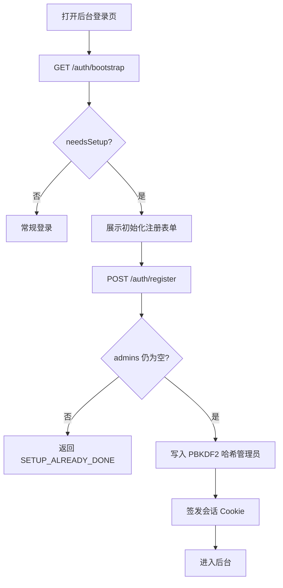

# 账号初始化（首次注册）方案说明

## 背景

后台具备账号管理与口令加密存储，但此前缺少用户注册入口。若部署环境未配置 `ADMIN_USERNAME` / `ADMIN_PASSWORD`，首次访问时可能无可用账号。

本实现采用**方案 B：首次登录注册流程**，并仅在系统尚无管理员时开放。

## 方案取舍（简要）

| 维度 | 方案 A：内置默认管理员 | 方案 B：首次注册（已选） |
|------|------------------------|--------------------------|
| 可行性 | 高，可复用现有播种与改密 | 中高，需新增初始化 API 与界面 |
| 安全性 | 依赖强制改密兜底默认口令 | 无默认口令，用户首注自选凭证 |
| 与单管理员模型 | 契合 | 契合（注册后关闭入口） |
| 改动面 | 较小 | 中等 |

选择 B 的主要原因：避免落盘或内置默认口令；注册严格限制在「无管理员」窗口，不构成开放注册。现有环境变量播种保留为运维兜底，二者不冲突。

## 功能设计



### 后端

| 能力 | 说明 |
|------|------|
| `GET /api/admin/auth/bootstrap` | 公开。返回 `{ needsSetup }`，表示是否尚无管理员 |
| `POST /api/admin/auth/register` | 公开。仅空库可创建唯一管理员，并直接登录 |
| 并发保护 | `INSERT ... WHERE NOT EXISTS (SELECT 1 FROM admins)`，降低并发首注重复建号风险 |
| 口令存储 | 沿用 PBKDF2（`hashPassword`），不存明文。新哈希 10 万次迭代（Workers WebCrypto 上限）；校验按哈希串内迭代次数 |
| 表单校验 | Zod：用户名 2–32 位（字母/数字/`_`/`-`），口令 ≥ 8 位且两次一致 |
| 限流 | 复用登录限流（IP / 账号失败计数） |
| 日志 | 注册成功/拒绝/限流、环境变量播种均输出 `[auth]` 结构化日志（不含口令） |
| 兼容 | 保留 `seedAdminIfEmpty`：若配置了成对的 `ADMIN_USERNAME`/`ADMIN_PASSWORD`，登录时仍可首次播种 |

### 前端（Studio 登录页）

- 进入登录页查询 bootstrap；`needsSetup === true` 时默认展示「初始化管理员」
- 字段：用户名、密码、确认密码、受信设备
- 注册成功后自动登录并进入后台
- 提供「已有账号，去登录」便于使用环境变量播种或已有账号

## 安全说明（建议性）

- 建议生产环境仍配置较强的 `SESSION_SECRET`；未配置时 GitHub Actions 部署会**自动生成并注入**（每次部署会轮换，已登录会话失效）。若需跨部署稳定，请自行写入 Repository secret: `SESSION_SECRET`
- `ADMIN_USERNAME`/`ADMIN_PASSWORD` 可选；未配置时走「初始化管理员」注册
- 注册接口仅在空库生效；已有管理员后重复调用会返回明确错误，避免被当作开放注册
- 更完整的暴力破解防护可继续依赖既有登录限流；如需更严策略，可按业务再收紧窗口参数

## 用户操作说明

### 首次部署（推荐：界面初始化）

1. 部署并打开后台入口（默认 `/admin`）
2. 若系统尚无管理员，登录页会显示「初始化管理员」
3. 填写用户名（2–32 位字母/数字/下划线/短横线）、口令（至少 8 位）并确认
4. 提交后自动登录；建议随后在「设置 → 账号安全」绑定恢复邮箱

### 可选：环境变量播种

1. 在部署环境中成对配置 `ADMIN_USERNAME` 与 `ADMIN_PASSWORD`
2. 在登录页使用该账号密码登录；首次成功时会写入 `admins` 表
3. 播种完成后环境变量不再参与校验，可按需清理

### 已有管理员之后

- 注册入口自动关闭；请使用登录、忘记口令或后台改密
- 改密路径：后台「设置 → 账号安全」

## 验收对照

| 验收项 | 实现情况 |
|--------|----------|
| 用户可创建/获取登录账号 | 空库首注；或环境变量播种 |
| 账号信息加密存储 | PBKDF2 哈希写入 `admins.password_hash` |
| 与现有账号管理兼容 | 单管理员模型、改密/重置/会话逻辑保持不变 |
| 日志可追踪 | `[auth]` 日志覆盖注册与播种关键节点 |
| 测试 | `apps/edge/src/services/auth.test.ts`、`env.test.ts` |

## 测试与自检

```bash
pnpm --filter @taiping/edge test
pnpm --filter @taiping/edge typecheck
```

建议在空库手动路径：打开登录页 → 初始化 → 登出 → 再次注册应被拒绝。
