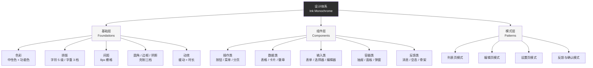

# 太平博客后台（Studio）B 端设计优化方案

> 版本：v1.0
> 范围：`apps/studio` 后台管理 SPA
> 性质：设计输出（不含代码实现）
> 方法：外部规范调研 → 独立推导设计体系 → 对照现状诊断差距 → 输出落地方案

---

## 0. 阅读指引

本文档的组织逻辑与常见的"设计评审报告"不同，特此说明：

```
第一部分  调研  ──▶  我们研究了什么（外部依据，带出处）
第二部分  推导  ──▶  理想的 B 端设计体系应该是什么（独立建立基准）
第三部分  诊断  ──▶  理想体系与当前实现的差距（含证据）
第四部分  方案  ──▶  如何落地（适配现有技术栈）
第五部分  规范  ──▶  可直接执行的 Design Token 与组件规范
第六部分  路线  ──▶  分阶段实施建议与验收标准
```

**关键立场**：本方案的设计基准**不来自**项目现有的 `taiping-admin-design/` 设计资产，也不来自 `apps/studio/src/styles/index.css` 的生产实现，而是先基于行业规范与设计技能独立推导，再把现状作为"差距对照物"。这样做的原因在 §3.0 详述——现有两套 token 互相冲突，任何"取其一"的做法都只是把一方的错误固化下来。

---

## 1. 调研：外部依据

### 1.1 调研来源

| 类别 | 来源 | 用途 |
|------|------|------|
| 设计规范 | Ant Design（布局/字体/配色/按钮/暗色/导航/列表/空态/反馈/数据展示/邻近性） | 主基准：中文 B 端事实标准 |
| 设计规范 | IBM Carbon Design System（Patterns 模式库） | 补充：模式完整性与分类框架 |
| 可用性理论 | Nielsen Norman Group《10 Usability Heuristics》 | 评审框架：交互质量判据 |
| 设计技能 | `modern-ui-design-audit`（2026 最佳实践 + WCAG 2.2 + 反 AI-slop） | 审计维度与严重度分级 |
| 设计技能 | `web-design-guidelines`（Vercel Web Interface Guidelines） | 界面细节合规 |
| 设计技能 | `frontend-design` / `frontend-skill` | 视觉方向与反套路化 |
| 设计技能 | `ui-design-zh` | 中文场景的评审与规范输出 |

### 1.2 关键调研结论（提炼）

**① 排版体系（Ant Design Font spec）**

- 基准字号 14px / 行高 22px（依据 50cm 阅读距离、0.3° 最佳视角）。
- 在同一个设计体系中，**字阶数量建议控制在 3–5 种**，"保持克制"。
- 字重通常只需 regular(400) 与 medium(500)，加粗场景可用 semibold(600)。
- 正文与背景的对比度遵循 WCAG，建议 **AAA 级（7:1 以上）**。
- 数字排版建议开启 `font-variant-numeric: tabular-nums`（等宽数字），用于数据表格对齐。

**② 布局与栅格（Ant Design Layout spec）**

- 基础栅格单位为 **8**，常用尺度为 8 的倍数，形成"动态韵律"。
- 采用 **24 栅格**架构；典型结构为左侧固定导航 + 右侧工作区动态缩放。
- 垂直间距公式：`y = 8 + 8n`（n ≥ 0）。
- 邻近性原则（Proximity）：三种垂直间距档位——**8px（小）/ 16px（中）/ 24px（大）**，通过间距的倍差划分信息层级。

**③ 色彩体系（Ant Design Colors spec）**

- 分两级：**系统级色板**（基础色 + 中性色 + 可视化色）与**产品级色系**（品牌色 + 功能色 + 中性色）。
- 品牌色建议从色板"由浅到深的第 6 阶"选取。
- 功能色（成功/错误/警告/链接）**应保持一致，不做过多定制**，避免干扰用户认知。
- 中性色基于**透明度**构建（如 `#000000E0` / `#000000A6` / `#00000040`），天然适配明暗背景。
- **企业后台对色彩持克制态度**：颜色用于信息传递、操作引导、交互反馈，而非装饰。

**④ 按钮类型学（Ant Design Button spec）**

- 常用五类：默认按钮、主按钮、文字按钮、图标按钮、带图标文字按钮。
- **一个按钮组内，主按钮最多一个**。
- 按重要性排序，次要操作靠右或靠下。
- 危险按钮：用户意图为删除时使用，警示风险；若系统不推荐删除，可把"取消"设为主操作。
- 图标按钮**必须提供 Tooltip** 说明含义。
- 按钮文案须用**动词**，且与上下文相关、简洁。
- 按钮组内不加分隔线，用间隔区分；分组时相似按钮可共用同一设计。

**⑤ 导航与信息架构（Ant Design Navigation spec）**

- 信息架构宜**浅、扁、宽**（shallow, flat, wide）。
- 应从**用户使用路径**出发考虑导航，而非仅按层级结构。
- 侧栏导航适用于**菜单项多于 6 个**的场景，且可见性与可扫描性优于顶栏；各菜单项的重要性受排列顺序影响较小。
- 顶栏导航适用于 2–7 项，且用户使用频率与排列顺序正相关。
- 完整导航应支持四类路径：横向移动、下钻、返回、关联跳转。
- **"逃生舱"**：点击 Logo 应能回到首页（Escape hatch）。
- 少于三级时不需要面包屑；有面包屑时不建议再放返回按钮。

**⑥ 列表页模式（Ant Design List Page spec）**

- 两大设计原则：**可扫描性（Scannability）**——用一致格式突出关键识别信息；**可查找性（Findability）**——逻辑化浏览顺序 + 合适的搜索组件。
- 布局分两类：**单列**（筛选模块在顶部，适合筛选条件少）与**双列**（筛选模块在侧边，适合筛选条件多且横向空间充足）。
- 批量操作影响整页时，可置于页面底部。

**⑦ 空态模式（Ant Design Empty Status spec）**

- 三段式：**状态提示 + 帮助引导 + 建议动作**。
- 三种场景：新用户引导（需解释说明 + 推荐动作）、已完成/已清空（无需动作引导）、无数据（图形 + 提示，建议动作视场景而定）。
- 核心目标：让用户理解"为什么空"，并提供"下一步能做什么"。

**⑧ 反馈模式（Ant Design Message and Feedback spec）**

- 反馈方式按任务与注意力需求匹配：
  - 成功·留在原页 → 全局消息（轻量、不打断）
  - 成功·跳转 → 行内文本 + 插图
  - 失败·留在原页 → 弹窗（重要）、警告条（需立即注意）、表单校验（输入不合规）
  - 失败·跳转 → 行内文本 + 插图
  - 后台操作 → 通知中心

**⑨ 数据展示（Ant Design Data Display spec）**

- 表格是"公认最清晰高效的数据呈现形式"，常用于结构化数据的收集展示、分析归纳与操作。
- **表格中的时间、状态、操作栏文字应保持完整不换行**。
- **单元格为空时用 `-` 表示无数据**。
- 卡片通常按栅格排布，建议最多 4 行；信息过长可截断。
- 时间线（Timeline）用于按时间流纵向展示，一般倒序记录事件。

**⑩ 模式库分类（IBM Carbon Patterns）**

Carbon 将模式归为：Common actions、Dialogs、Disabled states、Disclosures、Empty states、Filtering、Forms、Global header、Loading、Login、Notifications、Read-only inputs、Search、Text toolbar。可作为"模式覆盖度自检清单"。

**⑪ 可用性十原则（NN/g）**

与本项目最相关的五条：

| 编号 | 原则 | 对本项目的含义 |
|------|------|----------------|
| 1 | 系统状态可见（Visibility of System Status） | 加载/保存/失败状态必须即时、明确 |
| 4 | 一致性与标准（Consistency and Standards） | 同类操作跨页形态一致，遵循行业惯例 |
| 5 | 错误预防（Error Prevention） | 危险操作需确认；提供合理默认值 |
| 8 | 美学与极简（Aesthetic and Minimalist Design） | 剔除无关信息，聚焦核心任务 |
| 9 | 帮助用户识别、诊断、恢复错误 | 错误信息用平实语言，指出问题并给解法 |

**⑫ 审计框架（modern-ui-design-audit）**

- 审计工作流：反套路扫描 → 排版 → 色彩 → 间距 → 动效 → 无障碍 → 响应式 → 组件 → 输出报告。
- 严重度分级：**CRITICAL / MAJOR / MINOR / NIT**（本方案沿用）。
- 无障碍底线：正文对比度 4.5:1、UI 元素 3:1、焦点环 3:1 且 offset ≥ 2px、触控目标 ≥ 44×44px。
- 间距体系：8px 基数（密集界面可用 4px），禁止任意值（`p-[17px]` 之类）。
- 动效：缓动 `cubic-bezier(0.16, 1, 0.3, 1)`、微交互 100–200ms、仅动画 `transform`/`opacity`、尊重 `prefers-reduced-motion`。
- 反 AI-slop：禁用紫蓝渐变、避免千篇一律的卡片网格、避免"居中一切"、避免色彩等权重堆叠（遵循 60-30-10）。
- 值得注意的一条：**"骨架屏（skeleton）永远优于 spinner"**——针对内容密集型页面。

### 1.3 调研中需要"有取舍地采纳"的建议

调研结论并非全部适用于本项目，以下两条需明确不采纳，并说明理由：

| 调研建议 | 是否采纳 | 理由 |
|----------|----------|------|
| `modern-ui-design-audit`：禁用 Inter / system-ui 作为主字体，改用 Geist / DM Sans 等 | **不采纳** | 该建议面向英文营销页/作品集场景。本项目为**中文 B 端后台**，中文内容占绝对主导，系统字体栈（PingFang SC / Microsoft YaHei）在中文渲染上质量最优、零加载成本、跨平台一致。刻意引入西文字体反而在中文回退时产生割裂。保留系统栈是**有意的技术决策**。 |
| `modern-ui-design-audit`：纯白背景加噪点/渐变网格纹理 | **不采纳** | 该建议面向展示型页面。B 端后台以长时间数据阅读为主，纹理干扰可读性，与"克制用色"原则冲突。 |

其余建议（8px 栅格、8 的倍数字阶、WCAG 对比度、焦点可见、触控目标、动效缓动、骨架屏优先等）**全部采纳**。

---

## 2. 推导：理想 B 端设计体系

本节**独立建立**本项目应采用的设计基准。所有取值均有 §1 的调研依据，而非继承自现有代码。

### 2.1 设计定位

| 维度 | 定位 | 依据 |
|------|------|------|
| 产品类型 | 内容管理后台（CMS），单人/少人维护的博客系统 | 项目现状 |
| 核心任务 | 浏览列表、筛选、轻量编辑、配置 | 项目现状 |
| 使用环境 | 桌面为主（90%），移动端为辅 | 项目现状 + 调研（侧栏适配） |
| 信息密度 | **中高密度**（数据密集型） | 列表/表格为核心 |
| 视觉语言 | **墨色极简单色系**，克制用色，形态靠边框与间距而非阴影 | 调研：企业后台对色彩持克制态度；产品有"拙素/墨"的文化基调 |
| 反套路声明 | 明确**不做**：紫蓝渐变、等权重多彩、居中式英雄区、装饰性大圆角 | 调研：反 AI-slop；且符合产品调性 |

> **设计立场说明**：这个产品的视觉辨识度应来自"墨色单色的克制感与排版的秩序感"，而不是靠色彩堆叠。这与产品名（太平／拙素）的气质一致，也符合"B 端颜色服务于信息传递"的行业共识。

### 2.2 设计体系总览



### 2.3 色彩体系（推导结果）

**设计原则**：中性色承担 95% 的界面表达，功能色仅在语义必要时出现。色彩总量收敛，避免"多彩等权重"。

**中性色**（以透明度构建，透明度方案天然适配明暗背景——采纳 Ant Design 的做法）：

| 语义 | Light | Dark | 用途 |
|------|-------|------|------|
| 页面背景 | `#f7f7f7` | `#0f0f0f` | 应用底色 |
| 容器/卡片 | `#ffffff` | `#1a1a1a` | 承载内容的表面 |
| 次级表面 | `#fcfcfc` | `#262626` | 悬停、条纹、嵌套表面 |
| 主文本 | `#2e2e2e` | `#e5e5e5` | 标题与正文 |
| 次文本 | `#777777` | `#8c8c8c` | 辅助说明 |
| 禁用文本 | `#b0b0b0` | `#5a5a5a` | 不可用态 |
| 边框 | `#e8e8e8` | `#2a2a2a` | 容器描边 |
| 弱分割线 | `#f0f0f0` | `#222222` | 行分割、列表分隔 |

> 关于 `#f7f7f7` 与 `#FAFAFA` 的选择：两者皆可用。本方案取 `#f7f7f7`，因为它与卡片白 `#ffffff` 的对比略强，在数据密集页面中容器边界更清晰；这是基于"表格是核心"的产品特征的判断，而非沿袭现有代码。

**功能色**（5 个语义位，明暗各一套。取值遵循调研的"功能色保持一致、不做过多定制"原则，同时满足 WCAG AA 对比度）：

| 语义 | Light | Light 底色 | Dark | 用途 |
|------|-------|-----------|------|------|
| success 成功 | `#3f7d3a` | `#f0f7ef` | `#6bbf65` | 已发布、通过、完成 |
| warning 警告 | `#8f6b16` | `#faf5e8` | `#d4a72c` | 草稿、待处理、注意 |
| error 错误 | `#b83a3a` | `#fbf0f0` | `#e06b6b` | 失败、删除、驳回 |
| info 信息 | `#2c6599` | `#eff5fa` | `#6ba3d6` | 处理中、提示 |
| link 链接 | `#2c6599` | — | `#6ba3d6` | 可点击文本 |

**关键决策：功能色同时以两种变量名暴露**

调研发现项目存在 `--state-error` 与 `--destructive` 两个命名体系并存。为避免歧义，本方案**只保留一套语义命名** `--color-<semantic>-<emphasis>` 结构，并提供兼容别名层（见 §5.2）。理由是：命名双轨是导致本轮"变量引用失效"的直接成因，必须从根上收敛。

**对比度验证**（正文 14px 需 ≥ 4.5:1，采纳 WCAG AA 为底线、AAA 为追求）：

| 组合 | 对比度 | 判定 |
|------|--------|------|
| 主文本 `#2e2e2e` on 卡片 `#ffffff` | 11.6:1 | 通过 AAA |
| 主文本 `#2e2e2e` on 背景 `#f7f7f7` | 10.4:1 | 通过 AAA |
| 次文本 `#777777` on 卡片 `#ffffff` | 4.6:1 | 通过 AA |
| success `#3f7d3a` on 底 `#f0f7ef` | 4.9:1 | 通过 AA |
| error `#b83a3a` on 底 `#fbf0f0` | 5.3:1 | 通过 AA |

> 注意：`#777777` 在纯白上仅达 4.6:1，**仅可用于次要说明文字**，不得用于正文。正文一律用主文本色。

### 2.4 排版体系（推导结果）

**字体族**：`-apple-system, BlinkMacSystemFont, 'Segoe UI', 'PingFang SC', 'Microsoft YaHei', sans-serif`
（中文 B 端的最优解，理由见 §1.3）

**字阶**：采纳调研"控制在 3–5 种"的建议，本方案定 **5 级**，覆盖后台全部场景：

| 级别 | 字号 / 行高 | 字重 | 用途 |
|------|------------|------|------|
| display | 20px / 28px | 600 | 页面主标题 |
| title | 16px / 24px | 600 | 区块标题、面板标题 |
| body | 14px / 22px | 400 | 正文、表格、表单（**基准**） |
| label | 13px / 20px | 500 | 表单标签、按钮文字 |
| caption | 12px / 18px | 400 | 辅助说明、时间戳、徽章 |

**明确废弃**：11px 与 15px 不入阶。现有实现中出现的 `text-[10px]`、Tab 的 `15px` 属于**越级取值**，应回归到 caption(12px) 与 body(14px)。

**字重**：仅 3 档——400（正文）/ 500（标签、强调）/ 600（标题）。不引入 700。

**数字**：所有表格数值、统计数据一律启用 `font-variant-numeric: tabular-nums`（调研明确建议）。

**行长**：正文容器限制在合理范围内，避免行宽过大影响阅读。

### 2.4.1 文本折行约束（推导结果）
**核心原则**：**除长文本段落外，界面元素一律不折行。**

这是 B 端界面中极易被忽视、却在 AI 生成代码时高频出现的一类缺陷：功能性的短文本（徽章、按钮、标签、状态）在容器被压缩时逐字折行，导致「已发布」变成「已发 / 布」，破坏信息的整体可读性与专业感。

**分类规则**：

| 类别 | 元素 | 折行 | 空间不足时的处理 |
|------|------|------|-----------------|
| 功能性短文本 | 按钮、徽章、标签、状态值、表头、时间、操作项、分页 | **禁止** | 容器自适应加宽；必要时截断（配 `title` 提示） |
| 结构性文本 | 导航项、标签页、面包屑、表单标签 | **禁止** | 横向滚动或收纳菜单 |
| 长文本段落 | 正文、描述、摘要、帮助说明、错误信息 | **允许** | 正常折行，配合 `overflow-wrap` 防长词溢出 |

**技术要求**：

```css
/* 功能性元素 —— 不折行 */
button, .btn, .badge, .pill, .tag, .status,
table th, .nav-item, .tab-item, .field-label {
  white-space: nowrap;
}

/* 表格中除标题列外的所有列 —— 不折行 */
table.data th:not(:first-child),
table.data td:not(:first-child) {
  white-space: nowrap;
}

/* 长文本段落 —— 允许折行并防溢出 */
p, .description, .summary, .note {
  white-space: normal;
  overflow-wrap: break-word;
}
```

**验证要点**：这类缺陷在**桌面宽屏下往往不显现**，只在窄容器（侧栏、固定宽度列、移动端）或长文案压缩时才暴露。因此走查时**必须在窄视口下逐项检查**，不能只看宽屏效果。

> 本条的实践教训：本方案初版的规范页自身就出现了徽章折行——说明即便规则写在表格章节里，不提升为全局约束仍会被忽略。故此处单列。

### 2.5 间距体系（推导结果）

**基础单位 8px**，小尺寸场景（密集列表、图标内部）可用 4px 半步。

| Token | 值 | 典型用途 |
|-------|-----|----------|
| `space-1` | 4px | 图标与文字间距 |
| `space-2` | 8px | 紧密元素、徽章内边距 |
| `space-3` | 12px | 同组控件间距 |
| `space-4` | 16px | 卡片内边距（小）、表单字段间距 |
| `space-5` | 20px | 表格单元格内边距 |
| `space-6` | 24px | 卡片内边距（大）、区块间距 |
| `space-8` | 32px | 页面级区块分隔 |

**邻近性规则**（采纳调研的三档法）：

- **8px**：同一信息单元内部（标签与输入框）
- **16px**：相关字段之间
- **24px**：不同信息区块之间

**核心约束**：**禁止任意间距值**。所有内边距、外边距、间隙必须取自上述 token。这是消除当前"同类型容器三种内边距"问题的根本手段。

### 2.6 圆角、边框与阴影（推导结果）

**圆角**：三档，克制。

| Token | 值 | 用途 |
|-------|-----|------|
| `radius-sm` | 3px | 徽章、小按钮、输入框 |
| `radius-md` | 5px | 卡片、面板、按钮（默认） |
| `radius-lg` | 8px | 抽屉、弹窗、大容器 |
| `radius-full` | 9999px | 药丸标签、头像、开关 |

**明确废弃**：现有实现里的 `12px`、`50%`（除头像/圆形按钮外）等越级值。

> 圆角取 3/5/8 而非 2/4/6：B 端后台在 8px 栅格下，圆角若过小（2px）在高 DPI 屏上几乎不可见、显得陈旧；若过大则轻浮。3/5/8 是"可感知但不张扬"的区间。

**边框**：1px 实线，`--border` 或 `--border-subtle`。**边框是分隔的主要手段**，而非阴影。

**阴影**：仅用于**浮层**（抽屉、下拉菜单、弹窗、Toast）。静态卡片**不使用阴影**。

| Token | 值 | 用途 |
|-------|-----|------|
| `shadow-floating` | `0 8px 24px rgba(0,0,0,0.12), 0 2px 6px rgba(0,0,0,0.06)` | 浮层统一阴影 |

> 调研指出"静态表面靠边框、浮动图层可用更深阴影"。当前实现给静态卡片加了 `shadow-sm`，属于滥用，应予移除。

### 2.7 动效体系（推导结果）

| Token | 值 | 用途 |
|-------|-----|------|
| `duration-fast` | 120ms | 悬停、颜色变化 |
| `duration-base` | 180ms | 展开/收起、淡入 |
| `duration-slow` | 240ms | 抽屉、弹窗进出 |
| `ease-standard` | `cubic-bezier(0.16, 1, 0.3, 1)` | 标准缓动 |

**约束**（采纳调研）：

- 仅动画 `transform` 与 `opacity`（GPU 加速），不动画 `width`/`height`/`top`/`left`
- 全局尊重 `prefers-reduced-motion`
- 不使用弹跳/弹性缓动

### 2.8 无障碍基线（推导结果）

| 项 | 要求 | 依据 |
|----|------|------|
| 正文对比度 | ≥ 4.5:1 | WCAG AA |
| 大文本/UI 元素 | ≥ 3:1 | WCAG AA |
| 焦点可见 | 所有可交互元素有 `:focus-visible` 环，2px 且 offset ≥ 2px | WCAG 2.2 |
| 触控目标 | ≥ 44×44px（密集界面不低于 36px） | WCAG 2.5.8 |
| 图标按钮 | 必须有 `aria-label` 或 Tooltip | 调研：Ant Design 按钮规范 |
| 语义化 | 用 `<nav>`/`<main>`/`<button>`，非 div+onClick | WCAG |
| 状态不单靠颜色 | 色彩 + 文字/图形双重表达 | WCAG 1.4.1 |
| 键盘可达 | 所有交互可键盘操作，含 Esc 关闭、焦点陷阱 | WCAG 2.1 |

### 2.9 组件体系（推导结果）

**按钮**（综合 Ant Design 类型学 + 项目需求）：

| 变体 | 视觉 | 用途 | 约束 |
|------|------|------|------|
| `primary` | 实心墨色 | 页面/卡片的主操作 | 同一按钮组最多 1 个 |
| `secondary` | 描边白底 | 次要操作 | 缺失变体，需补齐 |
| `ghost` | 无边框 | 表格行内、工具栏 | |
| `danger` | 实心/描边红 | 删除等破坏性操作 | 必须配合二次确认 |
| `link` | 纯文字 | 内联跳转 | |

尺寸：`sm`(28px) / `md`(34px) / `lg`(40px)。图标按钮须方形且带 `aria-label`。

**徽章（Badge）**：语义化（success/warning/error/info/muted）+ 文字标签，不单靠颜色。

**表格**：表头吸顶、行悬停反馈、空值用 `-`、状态/时间/操作列不换行。

**空态**：三段式（状态提示 + 帮助引导 + 建议动作），统一组件。

**加载态**：内容密集型页面用**骨架屏**，轻量场景用统一 spinner。禁止"各页一句话"。

**反馈**：Toast 用于轻量成功/失败；对话框用于重要确认；表单错误行内展示。

---

## 3. 诊断：理想体系与现状的差距

### 3.0 为什么不能"在现有两套 token 中选一套"

调研与代码核查发现，项目当前存在**两套并行的设计 token 定义**，且值互相冲突：

| Token | `taiping-admin-design/colors_and_type.css`（设计资产） | `apps/studio/src/styles/index.css`（生产实现） |
|-------|------------------------------------------------------|---------------------------------------------|
| `--background` | `#FAFAFA` | `#f7f7f7` |
| `--foreground` | `#1A1A1A` | `#2e2e2e` |
| `--muted-foreground` | `#8C8C8C` | `#777777` |
| `--radius-sm` | `4px` | `2px` |
| success 色 | `#16A34A` | `#4a7c3f` |
| warning 色 | `#D97706` | `#a07820` |
| error 色 | `#DC2626` | `#c43c3c` |
| `--ring`（焦点环） | `#3B82F6` | **未定义** |
| `--state-*` 系列 | 已定义 | **未定义** |
| 暗色模式 | 已定义 `.dark` | **未定义** |
| 色阶命名 | `--color-primary-50~900` | `--primary-50~700`（阶数不同） |

**结论**：两套都是"半成品"——设计资产有完整体系但未被生产采纳；生产实现贴合实际但体系残缺。因此 §2 独立推导了目标体系，本节以该体系为标尺逐项测量差距。

### 3.1 严重度汇总

| 严重度 | 数量 | 说明 |
|--------|------|------|
| 🔴 CRITICAL | 3 | 功能失效或严重违规，建议优先修复 |
| 🟠 MAJOR | 6 | 显著影响体验或一致性 |
| 🟡 MINOR | 5 | 细节偏差，累积影响观感 |
| 🔵 NIT | 3 | 可选优化 |

### 3.2 CRITICAL

#### C1. 状态语义色变量未定义，导致颜色全面失效

- **证据**：`--state-error` / `--state-success` / `--state-warning` 在 `styles/index.css` 中**零定义**（该文件仅定义 `--destructive` / `--success` / `--warning` / `--info`），但被 `.tsx` 引用 **7 处**：
  - `pages/DashboardPage.tsx:154`（镜像失败数）
  - `pages/DashboardPage.tsx:264-268`（StatCard 的 warning/error/success 三态）
  - `pages/CommentAuditPage.tsx`（`text-[var(--state-error)]`）
  - `pages/TaxonomyPage.tsx`（分类删除等，3 处）
- **影响**：`var(--state-error)` 解析失败后，`color` 回退为 `inherit`。用户在概览页看到的"镜像失败"数字**不是红色**，"待审评论"**不是橙色**，"删除"类操作**没有红色警示**。这不是审美问题，而是**语义信息丢失**。
- **违反**：§2.3 色彩体系；NN/g 第 9 条（错误须有视觉提示）。
- **修复方向**：按 §5.2 统一定义功能色变量，并保留别名以兼容现有引用。

#### C2. `!important` 大面积滥用

- **证据**：`styles/index.css` 中 `!important` 共 **79 处**，其中编辑器相关补丁约占一半，其余分布在布局与响应式段（如 `.admin-main` 的 `padding: 12px 12px 64px !important`、`.admin-inner` 的 `max-width: 100% !important`、`.responsive-grid` 的 `grid-template-columns: 1fr !important`）。
- **影响**：样式优先级失控，任何后续调整都需要"用更暴力的 `!important` 覆盖 `!important`"，维护成本指数上升。
- **违反**：项目自定 `DESIGN.md` §3「禁止 `!important` 铺样式」；`modern-ui-design-audit` 明确列为反模式。
- **修复方向**：用作用域类名 + CSS 变量替代；编辑器第三方样式补丁可保留但需隔离到独立文件并注明来源。

#### C3. 无 `:focus-visible` 焦点样式

- **证据**：`styles/index.css` 全文**无 `:focus-visible` 规则**；组件层也未定义。浏览器默认焦点环在部分浏览器（尤其 Safari）几乎不可见。
- **影响**：键盘用户在后台**无法确认当前焦点位置**，表单与列表操作实际不可用。
- **违反**：WCAG 2.2 2.4.7/2.4.11；`modern-ui-design-audit` 列为 CRITICAL；NN/g 第 1 条。
- **修复方向**：全局定义 `:focus-visible { outline: 2px solid var(--ring); outline-offset: 2px; }`。

### 3.3 MAJOR

#### M1. 设计 token 双源漂移（根因级）

见 §3.0。两套定义并存导致"改了一处另一处不生效"，是 C1 的深层成因。**建议以 §5 的单一 token 源替换二者**。

#### M2. 圆角体系不统一，存在越级值

- **证据**：
  - 生产 `--radius-sm: 2px`，与设计资产 `4px` 不一致；
  - 内联魔数：`MomentListPage.tsx` 出现 `borderRadius: '50%'`、`'12px 12px 0 0'`（移动端抽屉）；
  - `styles/index.css:376` 抽屉移动端写死 `border-radius: 12px 12px 0 0`（无对应 token）；
  - 混用 `rounded-b-none` / `rounded-t-none` 拼接卡片（`PostListPage`、`CommentAuditPage`）。
- **影响**：同一界面元素圆角观感不一；`12px` 这类无 token 值后续无法统一调整。
- **违反**：§2.6 圆角体系。
- **修复方向**：统一采用 3/5/8 三档；拼接卡片改用统一 `Panel` 组件而非手工切圆角。

#### M3. 字阶越级（10px / 15px 脱离体系）

- **证据**：
  - `text-[10px]` 出现在 `MomentListPage.tsx`（4 处）、`MediaPage.tsx`、`CommentAuditPage.tsx`；
  - `.tab-item { font-size: 15px }`（`index.css:252`、`603`）——15px 不在任何字阶内；
  - `AppShell.tsx:76` 的 `text-[10px]`（Ctrl K 提示）。
- **影响**：10px 在中文下可读性差；15px 与 14px/16px 并存造成层级模糊。
- **违反**：§2.4 字阶（5 级），调研"字阶控制在 3–5 种"。
- **修复方向**：10px → caption(12px)；15px → body(14px)。

#### M4. 间距不成体系，同类容器三种内边距

- **证据**：
  - `.list-filter-bar` 用 `padding: 12px 20px`（`index.css:288`）
  - `.panel-header` 用 `padding: 12px 16px`（`index.css:277`）
  - `TaxonomyPage.tsx` 用 `p-4`（16px）
  - 三者都是"列表卡片头部"，水平内边距却为 20px / 16px / 16px。
- **影响**：相邻页面切换时内容左缘轻微跳动，产生"没对齐"的潜意识不适。
- **违反**：§2.5 间距体系；调研邻近性原则。
- **修复方向**：卡片内边距统一取 `space-5`(20px) 或 `space-4`(16px)，全站二选一并一致。

#### M5. 加载态与空态实现不统一

- **证据**：
  - **加载态** 6 种文案：`加载中…`（PostList）、`加载中...`（半角点，CommentAudit）、`加载概览中…`（Dashboard）、`加载镜像状态中…`（Dashboard）、`加载设置中…`（Settings）、`编辑器加载中…`（PostEdit）。全部为纯文本，**无骨架屏、无统一 spinner**。
  - **空态**两套实现：列表页用统一 `EmptyState` 组件；而 `DashboardPage.tsx:188/245`、`MomentListPage`、`MediaConfigManager` 用裸 `<p>` 文本。
- **影响**：页面间观感割裂；等待期间无结构占位，内容跳变（违反 NN/g 第 1 条）。
- **违反**：§2.9 组件体系；调研"骨架屏优于 spinner"。
- **修复方向**：建立统一 `LoadingState`（骨架屏 + 轻量 spinner 两档）与统一空态组件，替换所有裸文本。

#### M6. 键盘可达性与焦点管理缺失

- **证据**：
  - `TaxonomyPage.tsx` 分类列表项用 `<li>` + `onClick`，**非 button、无 `tabIndex`/`role`**，键盘不可达；
  - `CommentAuditPage.tsx` 评论列表项同理；
  - `RowMenu.tsx` 下拉菜单**无 Esc 关闭、无 `aria-haspopup`/`aria-expanded`、无方向键导航**；
  - `Drawer.tsx` 有 Esc 与滚动锁，但**打开时不聚焦面板、无焦点陷阱、关闭不归还焦点**；
  - `CommentAuditPage` 的抽屉未绑定 Esc、无 `role="dialog"`；
  - `MomentListPage` 图片删除按钮仅靠 `group-hover` 显隐，触屏与键盘均不可达。
- **影响**：纯键盘用户无法完成分类管理、评论审核等核心任务。
- **违反**：WCAG 2.1；§2.8 无障碍基线。
- **修复方向**：列表项改 `<button>`；菜单与抽屉补齐 ARIA 与焦点管理（焦点陷阱 + 归还）。

### 3.4 MINOR

#### m1. 触控目标小于基线

- **证据**：`Pagination.tsx:21/33` 分页按钮 `w-7 h-7`(28px)；`RowMenu.tsx:29` `w-7 h-7`；`AppShell.tsx:121` 退出按钮 `w-8 h-8`(32px)；`Drawer.tsx`/`Tabs.tsx` 关闭按钮 `w-7 h-7`。
- **影响**：移动端误触率上升。
- **违反**：§2.8（建议 ≥44px，密集界面不低于 36px）；WCAG 2.5.8。
- **修复方向**：交互按钮最小 36×36px（移动端 44×44px）；可通过扩大 padding 实现而不改变视觉尺寸。

#### m2. 按钮变体缺失，形态各行其是

- **证据**：`Button.tsx` 仅实现 `primary` / `ghost` / `danger` 三变体；设计资产定义了 `.btn-secondary` 但未被组件采纳。页面中"次要操作"因此混用 ghost 与临时类名。
- **影响**：主次操作视觉层级不稳定。
- **违反**：§2.9 按钮体系。
- **修复方向**：补齐 `secondary` 与 `link` 变体。

#### m3. 导航图标语义重复

- **证据**：`AppShell.tsx:39-40` 中 `/moments`（说说）与 `/comments`（评论）**同用 `MessageSquare` 图标**；移动端底栏（`:48-53`）同样重复。
- **影响**：图标失去识别功能，用户需读文字才能区分。
- **违反**：§2.8（状态/语义不单靠颜色，图标亦然）。
- **修复方向**：评论改用 `MessageCircle` 或 `MessagesSquare` 区分。

#### m4. 响应式断点分散重复

- **证据**：`styles/index.css` 中 `@media` 共 **9 处**，`max-width: 767px` 与 `min-width: 768px` 交替出现 **4 轮**（366/404/634/688/780/805/830/1016/1084 行）。
- **影响**：同一断点逻辑散落多处，改一处易漏其余。
- **违反**：可维护性；§2.5 体系化要求。
- **修复方向**：断点收敛为集中定义（CSS 变量无法用于媒体查询，但可集中到一个 `@media` 段或用构建工具统一）。

#### m5. 移动端导航命名不一致

- **证据**：`AppShell.tsx:53` 移动端底栏"设置"项的 label 写作**「我的」**，而侧栏（`groupLabels`/`menuItems`）为「设置」。
- **影响**：同一入口两端两个名字，认知不一致。
- **违反**：NN/g 第 4 条一致性。
- **修复方向**：统一为「设置」。

### 3.5 NIT

- **n1**：`Toast.tsx:18-19` 硬编码 `#C43C3C` / `#2E2E2E`，应改用功能色变量。
- **n2**：`Card.tsx:12` 使用的 `.card` 类带 `shadow-sm`，与 §2.6"静态卡片不用阴影"冲突。
- **n3**：危险操作确认方式不统一——多数用原生 `window.confirm`（观感与产品调性不符），而 `MediaConfigManager` 删除图床配置**无任何确认**，属遗漏。
- **n4**：功能性短文本缺少不折行约束。现有实现中 `Badge` 组件（`Badge.tsx`）与 `Pagination` 等未声明 `white-space: nowrap`，在窄列或长文案下会出现徽章文字逐字折行（如「已发布」拆为两行）。详见 §2.4.1。

### 3.6 差距一览表

| 维度 | 理想体系（§2） | 现状 | 差距 |
|------|---------------|------|------|
| 色彩 | 单一 token 源，功能色 5 语义位 | 双源冲突，`--state-*` 缺失 | 🔴 严重 |
| 排版 | 5 级字阶 | 混入 10px / 15px | 🟡 中 |
| 间距 | 8px 栅格 | 同类容器 16/20px 混用 | 🟡 中 |
| 圆角 | 3 / 5 / 8 | 2px + 内联 12px / 50% | 🟠 较重 |
| 阴影 | 仅浮层 | 静态卡片也带 shadow | 🔵 轻 |
| 动效 | 统一缓动 + 时长 | 未成体系 | 🟡 中 |
| 无障碍 | WCAG AA 基线 | 焦点环缺失、键盘不可达 | 🔴 严重 |
| 组件 | 完整变体 + 统一态 | 缺 secondary、态不统一 | 🟠 较重 |
| 响应式 | 断点集中 | 9 处分散 | 🟡 中 |

---

## 4. 落地方案：四大改进板块

本节给出"怎么改"的思路，具体取值见 §5 规范。

### 4.1 板块一：视觉风格统一

**问题根源**：token 双源 + 越级取值 + 阴影滥用。

**改进策略**

1. **建立单一 token 源**。按 §5.1 新建一份完整 token 定义，作为唯一事实来源。`apps/studio/src/styles/index.css` 的 `:root` 段整体替换为新 token；`taiping-admin-design/colors_and_type.css` 定位从"设计资产"降级为"历史参考"，避免继续双写。
2. **兼容别名层**。由于现有 `.tsx` 引用了 `--state-*`，在新 token 中同时定义 `--state-error` 等别名指向规范语义色，使 C1 立即修复且无需改动业务代码（详见 §5.2）。
3. **清除静态阴影**。`.card` 移除 `shadow-sm`，仅保留 1px 边框；阴影只出现在抽屉、下拉、弹窗、Toast。
4. **收敛圆角与字阶**。按 §2.4 / §2.6 替换所有越级值。
5. **统一间距**。为 `list-filter-bar`、`panel-header` 等同类容器指定统一内边距 token。
6. **施加文本折行约束**。按 §2.4.1 为功能性元素（按钮、徽章、标签、状态、表头、导航）统一声明不折行；仅长文本段落允许折行。

**验收**：全站搜索 `#[0-9a-f]` 仅允许出现在 token 定义文件；搜索 `text-[10px]`、`15px`、`!important` 应大幅下降至仅编辑器补丁范围；窄视口下徽章/按钮/表头均不折行。

### 4.2 板块二：交互逻辑优化

**问题根源**：态不统一 + 关键交互缺失 + 危险操作无防护。

**改进策略**

1. **建立状态组件三件套**：
   - `LoadingState`：两档——`skeleton`（列表/卡片/详情，内容密集）与 `inline`（按钮内、轻量区）。
   - `EmptyState`：统一三段式（状态提示 + 帮助引导 + 建议动作），替换所有裸 `<p>`。
   - `ErrorState`：失败展示 + 重试动作，用于数据加载失败。
2. **统一危险操作确认**。删除类操作一律二次确认；推荐使用与产品调性一致的**对话框**替代原生 `window.confirm`（原生 confirm 无法定制、在部分浏览器阻塞渲染）。补上 `MediaConfigManager` 缺失的确认。
3. **补齐错误处理**。所有异步操作（如 `DashboardPage` 的镜像重试）必须有失败反馈（Toast/ErrorState），遵循 NN/g 第 9 条：平实语言 + 指出问题 + 给出解法。
4. **补齐组件变体**。`Button` 增加 `secondary` 与 `link`；约束"一个按钮组最多一个 primary"。
5. **反馈方式匹配场景**（采纳 §1.2 ⑧）：成功且留在原页用 Toast；成功且跳转用行内提示；失败且需决策用对话框；表单错误行内展示。

### 4.3 板块三：信息架构重组

**问题根源**：导航分组语义混乱、图标重复、标题层级不一致、筛选与列表关系不清。

**改进策略**

1. **导航分组重新归类**。按"用户使用路径"（调研建议）而非技术归属分组，建议四组：

| 分组 | 归属页面 | 理由 |
|------|----------|------|
| （置顶，无标题） | 概览 | 首页入口优先 |
| 内容 | 文章、页面、说说、评论、图床、分类标签 | 都是内容生产与维护 |
| 外观 | 主题 | 站点外观 |
| 系统 | 设置 | 站点级配置 |

> 说明：现有实现把"分类标签"归入「界面」组，属于技术归属而非用户心智归属，应移入「内容」组。
>
> 「图床」按用户使用路径判断，本质上服务于内容配图（写文章时挑选图片）与媒体资源管理，属于内容生产链的一环，因此归入「内容」组；「设置」是站点级配置，独立成组。
>
> 判断标准的一致性：凡"为内容服务的基础数据与资源"（图床、分类标签）均归内容；仅"站点级配置"归系统。避免出现两者分属不同组的不一致。

2. **图标去重**。评论与说说使用不同图标；每组内图标语义互不重叠。
3. **统一标题层级**。page 级用 `display`(20px)，面板级用 `title`(16px)，避免"面板标题比正文还小"。建立 `PageHeader`（页面级）与 `PanelHeader`（区块级）两级组件。
4. **明确筛选与列表的从属关系**。筛选栏与列表应属**同一张卡片**（视觉一体），而非两张卡拼接。列表页采纳调研的单列模式（筛选在顶部），仅在筛选条件很多时才考虑双列。
5. **补全导航路径**。编辑页提供明确的返回入口；Logo 可点击回首页（逃生舱）。

### 4.4 板块四：响应式设计适配

**问题根源**：断点分散、触控目标不足、移动端有遗漏。

**改进策略**

1. **断点收敛**。统一使用两档（对齐现有 `768px` 习惯）：
   - `< 768px`：移动端（侧栏隐藏，底部导航，抽屉改底部面板）
   - `≥ 768px`：桌面端
   将散落的 9 处 `@media` 逻辑合并整理，避免同断点重复定义。
2. **移动端导航统一**。底栏 5 项固定为核心流程（概览 / 文章 / 说说 / 评论 / 设置），命名与侧栏一致。
3. **触控目标达标**。所有可点元素 ≥ 36px（移动端 ≥ 44px），可通过透明扩展点击区域实现。
4. **危险操作在移动端同样有确认**。
5. **横向溢出防护**。日历热力图等固定列宽组件在窄屏需启用横向滚动或缩放，避免撑破布局。
6. **内容宽度**。桌面端内容区保持合理最大宽度（如 1024px）并居中；移动端占满。

---

## 5. 设计规范（可直接执行）

### 5.1 Design Token 完整定义

以下为**唯一事实来源**。建议落地为 `apps/studio/src/styles/tokens.css`，由 `index.css` 引入。

```css
/* ==========================================================================
   Taiping Studio — Design Tokens
   风格：Ink Monochrome（墨色极简单色系）
   基准：8px 栅格 / 5 级字阶 / 3 档圆角
   ========================================================================== */

:root {
  color-scheme: light;

  /* ---------- 中性色 ---------- */
  --background:        #f7f7f7;  /* 页面底色 */
  --card:              #ffffff;  /* 容器表面 */
  --secondary:         #fcfcfc;  /* 次级表面（悬停/嵌套） */
  --muted:             #f5f5f5;  /* 弱化底 */

  --foreground:        #2e2e2e;  /* 主文本 */
  --muted-foreground:  #777777;  /* 次文本（仅辅助说明） */
  --disabled-foreground: #b0b0b0;/* 禁用文本 */

  --border:            #e8e8e8;  /* 容器描边 */
  --border-subtle:     #f0f0f0;  /* 弱分割线 */

  /* ---------- 功能色（5 语义位） ---------- */
  --color-success:        #3f7d3a;
  --color-success-bg:     #f0f7ef;
  --color-warning:        #8f6b16;
  --color-warning-bg:     #faf5e8;
  --color-error:          #b83a3a;
  --color-error-bg:       #fbf0f0;
  --color-info:           #2c6599;
  --color-info-bg:        #eff5fa;
  --color-link:           #2c6599;

  /* ---------- 兼容别名（供既有 .tsx 引用，勿新增使用） ---------- */
  --state-success:     var(--color-success);
  --state-warning:     var(--color-warning);
  --state-error:       var(--color-error);
  --state-info:        var(--color-info);
  --success:           var(--color-success);
  --warning:           var(--color-warning);
  --destructive:       var(--color-error);
  --info:              var(--color-info);
  --destructive-foreground: #ffffff;
  --primary-foreground: #ffffff;

  /* ---------- 主色（墨色） ---------- */
  --primary:           #2e2e2e;

  /* ---------- 焦点 ---------- */
  --ring:              #2e6ea8;  /* 焦点环，与 info 同族，保证 3:1 可见 */

  /* ---------- 排版 ---------- */
  --font-sans: -apple-system, BlinkMacSystemFont, 'Segoe UI',
               'PingFang SC', 'Microsoft YaHei', sans-serif;
  --font-mono: 'SF Mono', 'Cascadia Code', Consolas, monospace;

  --text-display: 20px;  --leading-display: 28px;
  --text-title:   16px;  --leading-title:   24px;
  --text-body:    14px;  --leading-body:    22px;
  --text-label:   13px;  --leading-label:   20px;
  --text-caption: 12px;  --leading-caption: 18px;

  /* ---------- 间距（8px 栅格） ---------- */
  --space-1: 4px;
  --space-2: 8px;
  --space-3: 12px;
  --space-4: 16px;
  --space-5: 20px;
  --space-6: 24px;
  --space-8: 32px;

  /* ---------- 圆角 ---------- */
  --radius-sm:   3px;
  --radius-md:   5px;
  --radius-lg:   8px;
  --radius-full: 9999px;

  /* ---------- 阴影（仅浮层） ---------- */
  --shadow-floating: 0 8px 24px rgba(0, 0, 0, 0.12),
                     0 2px 6px rgba(0, 0, 0, 0.06);

  /* ---------- 动效 ---------- */
  --duration-fast: 120ms;
  --duration-base: 180ms;
  --duration-slow: 240ms;
  --ease-standard: cubic-bezier(0.16, 1, 0.3, 1);

  /* ---------- 布局 ---------- */
  --sidebar-width:      240px;
  --content-max-width: 1024px;
}

.dark {
  color-scheme: dark;

  --background:        #0f0f0f;
  --card:              #1a1a1a;
  --secondary:         #262626;
  --muted:             #262626;

  --foreground:        #e5e5e5;
  --muted-foreground:  #8c8c8c;
  --disabled-foreground: #5a5a5a;

  --border:            #2a2a2a;
  --border-subtle:     #222222;

  --color-success:     #6bbf65;  --color-success-bg: #16301a;
  --color-warning:     #d4a72c;  --color-warning-bg: #2e2410;
  --color-error:       #e06b6b;  --color-error-bg:   #331616;
  --color-info:        #6ba3d6;  --color-info-bg:    #142334;
  --color-link:        #6ba3d6;

  --primary:           #e5e5e5;
  --primary-foreground: #0f0f0f;
  --ring:              #6ba3d6;
}

/* ---------- 全局基线 ---------- */
* { border-color: var(--border); }

body {
  margin: 0;
  background: var(--background);
  color: var(--foreground);
  font-family: var(--font-sans);
  font-size: var(--text-body);
  line-height: var(--leading-body);
  -webkit-font-smoothing: antialiased;
}

/* 焦点可见性 —— 修复 C3 */
:focus-visible {
  outline: 2px solid var(--ring);
  outline-offset: 2px;
}

/* 数字等宽 —— 表格与统计数据 */
.tabular-nums { font-variant-numeric: tabular-nums; }

/* 文本折行约束 —— 功能性元素不折行，长文本段落允许折行（见 §2.4.1） */
button, .btn, .badge, .pill, .tag, .status,
table.data th, .nav-item, .tab-item, .field-label {
  white-space: nowrap;
}
table.data th:not(:first-child),
table.data td:not(:first-child) {
  white-space: nowrap;
}
p, .description, .summary, .note {
  white-space: normal;
  overflow-wrap: break-word;
}

/* 动效安全 —— 尊重系统偏好 */
@media (prefers-reduced-motion: reduce) {
  *, *::before, *::after {
    animation-duration: 0.01ms;
    transition-duration: 0.01ms;
  }
}
```

### 5.2 Token 迁移对照表

| 现有（生产 `index.css`） | 目标（新规范） | 处理方式 |
|------------------------|---------------|----------|
| `--primary-50` … `--primary-700` | 移除 | 无调用则删除 |
| `--success` / `--warning` / `--destructive` / `--info` | `--color-*` 系列 | 保留为别名 |
| `--state-error` 等（**未定义但被引用**） | `--color-error` + 别名 | **新增定义**，修复 C1 |
| `--radius: 4px` / `--radius-sm: 2px` / `--radius-lg: 6px` | 3 / 5 / 8 | 替换，视觉微调 |
| `--shadow-floating` | 保留 | 值不变 |
| `.card` 的 `shadow-sm` | 移除 | 静态卡片去阴影 |
| `--ring`（未定义） | 新增 | 修复 C3 |

### 5.3 组件规范速查

**按钮尺寸**

| 尺寸 | 高度 | 水平内边距 | 字号 | 场景 |
|------|------|-----------|------|------|
| sm | 28px | 12px | 12px | 表格行内、工具栏 |
| md | 34px | 16px | 13px | 默认 |
| lg | 40px | 20px | 14px | 表单主操作 |

**徽章（Badge）语义**

| tone | 底色 | 文字色 | 场景 |
|------|------|--------|------|
| success | `--color-success-bg` | `--color-success` | 已发布、已通过 |
| warning | `--color-warning-bg` | `--color-warning` | 草稿、待处理 |
| error | `--color-error-bg` | `--color-error` | 已驳回、失败 |
| info | `--color-info-bg` | `--color-info` | 处理中 |
| muted | `--muted` | `--muted-foreground` | 已归档、停用 |

徽章必须**带文字**（如「已发布」），不可只用颜色点——满足 WCAG 1.4.1。

**空态文案模板**（三段式）

```
[状态提示]  还没有文章
[帮助引导]  文章发布后会出现在站点首页和归档中
[建议动作]  [写第一篇文章]
```

**加载态选择**

| 场景 | 形态 |
|------|------|
| 列表 / 表格 / 卡片 | 骨架屏（保持布局占位） |
| 详情页首屏 | 骨架屏 |
| 按钮提交 | 按钮内 spinner + 禁用 |
| 轻量局部刷新 | 内联 spinner |

**间距速查**

| 场景 | 取值 |
|------|------|
| 图标与文字 | `space-1` (4px) |
| 标签与输入框 | `space-2` (8px) |
| 表单字段之间 | `space-4` (16px) |
| 卡片内边距 | `space-4`~`space-6` (16–24px) |
| 表格单元格 | `space-5` (20px) 水平 / `space-3` (12px) 垂直 |
| 页面区块之间 | `space-6` (24px) |

---

## 6. 实施路线

### 6.1 分阶段建议

按"先止血、再统一、后精修"的顺序推进。建议每阶段独立提交、独立验收，避免一次性大改带来的回归风险。

**阶段一 · 止血（建议优先）**

| 项 | 内容 | 影响面 |
|----|------|--------|
| 1 | 新建 `tokens.css`，补齐 `--state-*` 与 `--ring` | 修复 C1、C3 |
| 2 | 全局 `:focus-visible` 规则 | 修复 C3 |
| 3 | `Toast.tsx` 硬编码色改变量 | 修复 n1 |

预计改动量小，但消除 3 个 CRITICAL 中的 2 个。

**阶段二 · 统一（体系收敛）**

| 项 | 内容 |
|----|------|
| 1 | 全量替换 token，移除旧定义与 `--primary-*` 色阶 |
| 2 | `.card` 去阴影；圆角统一 3/5/8；字阶收敛到 5 级 |
| 3 | 卡片内边距统一（消除 16/20px 混用） |
| 4 | 断点整理，`@media` 合并去重 |
| 5 | `Button` 补齐 `secondary` / `link` 变体 |

**阶段三 · 组件与模式**

| 项 | 内容 |
|----|------|
| 1 | 建立 `LoadingState` / `EmptyState` / `ErrorState` 并全站替换 |
| 2 | 统一危险操作确认（对话框替代 `window.confirm`），补 `MediaConfigManager` |
| 3 | 补齐异步操作的失败反馈 |
| 4 | 导航分组重组、图标去重、标题层级统一 |
| 5 | 筛选栏与列表合并为同一卡片 |

**阶段四 · 无障碍与响应式**

| 项 | 内容 |
|----|------|
| 1 | 列表项改 `<button>`；菜单/抽屉补齐 ARIA 与焦点管理 |
| 2 | 触控目标提升至 36/44px |
| 3 | 移动端命名统一；横向溢出防护 |
| 4 | 键盘走查全部核心流程 |

**阶段五 · 收尾**

| 项 | 内容 |
|----|------|
| 1 | 移除可清理的 `!important`（保留编辑器补丁并注明） |
| 2 | 全站回归：色彩/间距/圆角/字阶一致性走查 |
| 3 | 更新 `DESIGN.md`，把本方案规范固化 |

### 6.2 验收标准

| 检查项 | 标准 | 验证方式 |
|--------|------|----------|
| Token 单一来源 | `#[0-9a-f]` 硬编码仅出现在 token 文件 | 全站搜索 |
| 状态色生效 | 概览页"镜像失败"为红色、"待审"为橙色 | 目视 |
| 焦点可见 | Tab 走查所有交互元素均见焦点环 | 键盘走查 |
| 对比度 | 正文 ≥ 4.5:1，UI ≥ 3:1 | WebAIM Contrast Checker |
| 字阶 | 无 10px / 15px 等越级值 | 搜索 `text-[` 与 `font-size` |
| 间距 | 无任意值（`p-[17px]` 类） | 搜索 |
| 触控目标 | 可点元素 ≥ 36px（移动端 ≥ 44px） | 移动端实测 |
| 键盘可达 | 核心流程（列表→编辑→保存）全程可键盘完成 | 键盘走查 |
| 空态 | 无裸 `<p>` 空态，全部走 `EmptyState` | 代码走查 |
| 危险操作 | 所有删除均有二次确认 | 逐项点击 |
| 移动端 | 无横向溢出；底栏命名与侧栏一致 | 375px 宽度实测 |
| 文本折行 | 徽章/按钮/标签/状态/表头在窄视口下均不折行 | 窄视口逐项走查（见 §2.4.1） |
| 动效安全 | 开启"减少动态效果"后动画降级 | 系统设置实测 |

### 6.3 风险与权衡

| 风险 | 说明 | 缓解 |
|------|------|------|
| 视觉可见变化 | 圆角 2→3px、卡片去阴影会带来轻微观感变化 | 变化方向为"更现代"，建议整体一次性切换而非逐页断续 |
| 兼容别名残留 | 别名层解决了 C1，但会长期存在 | 建议在阶段五清理，或直接用新变量名替换引用 |
| 深色模式 | 新 token 已预留 `.dark`，但现实现无切换入口 | 可作为独立需求后续引入，token 层已就绪 |
| 编辑器 `!important` | OverType 第三方样式需覆盖，难以完全清除 | 隔离到独立文件并注明来源，不参与主样式规则 |

---

## 7. 附录

### 7.1 引用来源

- Ant Design 设计规范：Layout / Font / Colors / Buttons / Dark Mode / Navigation / List Page / Empty Status / Message and Feedback / Data Display / Proximity
- IBM Carbon Design System：Patterns Overview
- Nielsen Norman Group：《10 Usability Heuristics for User Interface Design》
- 设计技能：`modern-ui-design-audit`、`web-design-guidelines`、`frontend-design`、`ui-design-zh`

### 7.2 诊断方法说明

本方案的现状诊断采用「静态代码审计 + 交叉验证」：

1. 由审计子代理逐文件精读 `apps/studio/src` 下全部页面与组件；
2. 由主流程独立复核关键结论（token 定义、`!important` 计数、硬编码色、断点分布）并相互印证；
3. 所有结论均附 `文件:行号` 证据，可回溯。

对于**运行时行为**（如实际交互体验、真实设备表现），本文档未做验证，相关结论基于代码静态推断，建议实施前以浏览器实测确认。

### 7.3 术语表

| 术语 | 含义 |
|------|------|
| Token | 设计变量，如 `--color-error`，样式取值的唯一来源 |
| 字阶 | 一组有序的字号等级 |
| 栅格 | 8px 基准的间距体系 |
| 三段式空态 | 状态提示 + 帮助引导 + 建议动作 |
| 骨架屏 | 内容加载时展示的布局占位图形 |
| 焦点陷阱 | 弹层打开时限制 Tab 焦点在层内循环 |
| 逃生舱 | 用户随时可退出当前流程的入口 |
