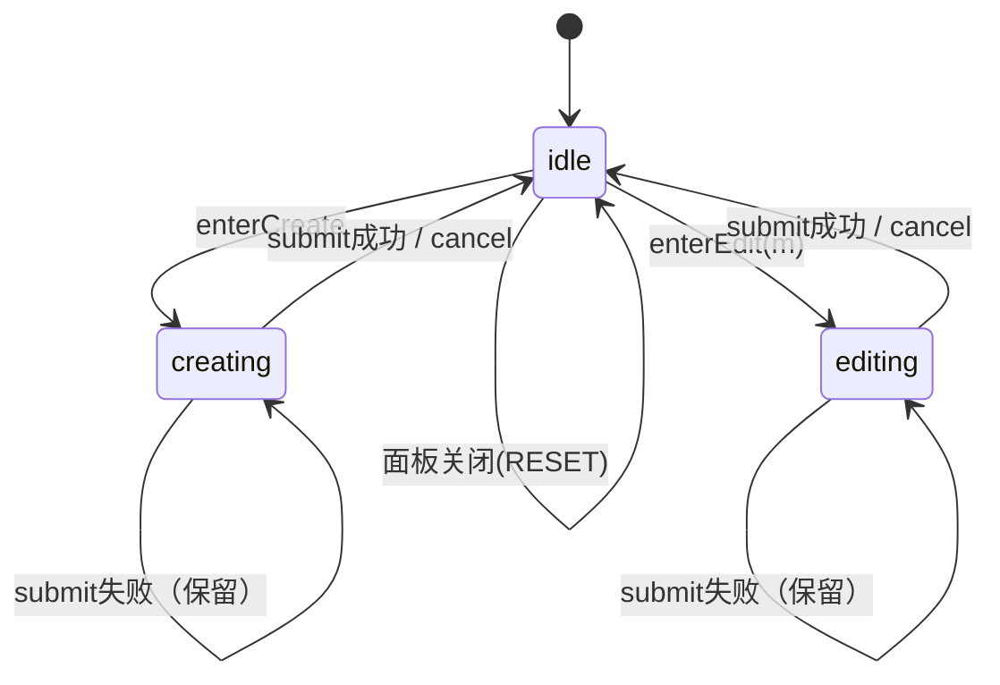
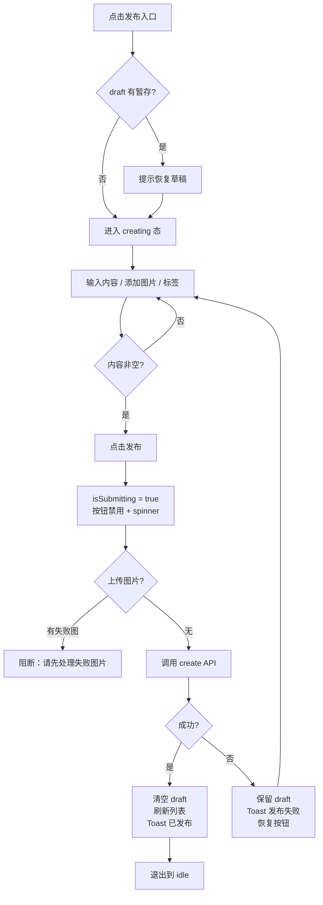
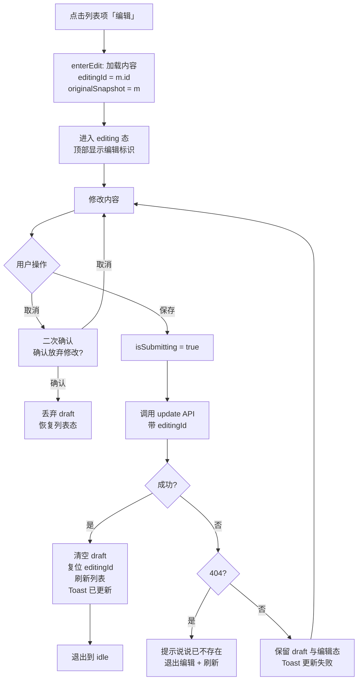
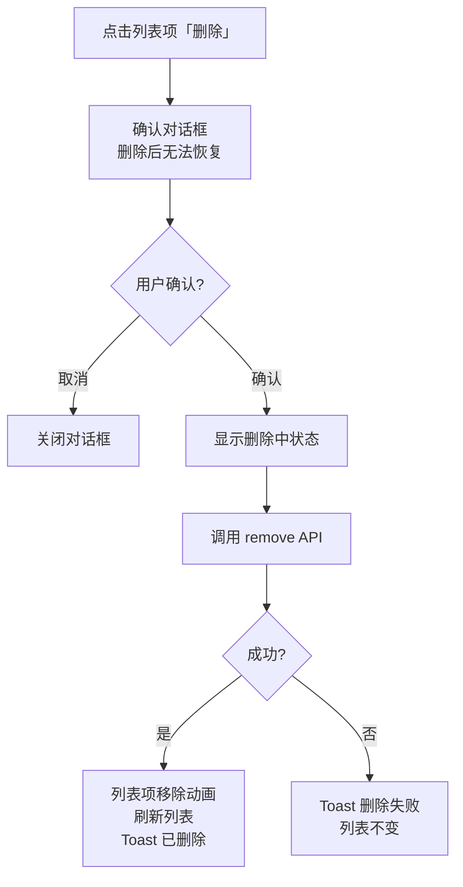

# 说说（短消息社交）功能优化方案

> 版本：v1.0
> 范围：`apps/studio` 说说模块（图片上传、宫格样式、编辑状态管理、整体流程）
> 性质：设计方案（文档 + 交互原型），不含代码实现
> 方法：竞品与规范调研 → 问题诊断 → 设计规范 → 流程与状态设计

---

## 0. 阅读指引

```
第一部分  调研      ──▶  行业规范与竞品做法（带出处）
第二部分  诊断      ──▶  现状问题定位（含截图证据与代码行号）
第三部分  设计规范  ──▶  图片上传、宫格样式、状态管理
第四部分  流程设计  ──▶  新建 / 编辑 / 删除三条流程 + 异常分支
第五部分  数据模型  ──▶  状态定义与 API 契约
第六部分  验收      ──▶  指标与走查清单
```

---

## 1. 调研：行业规范与竞品做法

### 1.1 来源

| 来源 | 用途 |
|------|------|
| Ant Design `Upload` 组件规范 | 图片上传的组件级事实标准（中文 B 端） |
| Ant Design `反馈` 设计规范 | 加载/结果反馈的时机与形态 |
| Nielsen Norman Group《Progress Indicators》 | 进度指示器的选择依据 |
| NN/g 十大启发式 | 交互质量判据 |

### 1.2 关键结论

**① 图片上传的组件模式（Ant Design Upload）**

- **照片墙模式（`picture-card`）**：卡片式缩略图列表，官方默认尺寸 **102px**；数量达上限后上传按钮自动消失。这与本方案建议的 100×100px 九宫格高度吻合。
- **数量限制（`maxCount`）**：组件原生支持上限控制。
- **上传前校验（`beforeUpload`）**：可拦截格式与大小；返回 `false` 或 `Promise.reject` 可阻止上传。
- **自定义上传（`customRequest`）**：可覆盖默认行为，接入自有存储（如图床）。
- **文件状态机（`UploadFile.status`）**：`uploading` / `done` / `error` / `removed`，并带 `percent` 进度字段——**这是上传态设计的标准模型**。
- **多选与拖拽**：`multiple` 支持多选；拖拽区域可与点击上传并存。
- **列表拖拽排序**：官方通过 `itemRender` 集成拖拽库实现——**证明"拖拽排序"是标准能力而非额外需求**。

**② 反馈的时机与形态（Ant Design 反馈规范）**

- **超过 2 秒**的操作应即时给出加载状态或进度条，保持与用户的沟通。
- **加载时间较长时，应提供取消操作。**
- **重要的失败信息建议用对话框**，而非会自动消失的轻量提示（默认 3s），避免用户遗漏。
- 反馈应"必要、积极、即时"，但**避免过度反馈**——能立即看到效果的简单操作可省略提示。
- 录入反馈（错误说明）应紧跟对应区块，**不自动消失**，直到用户修正。

**③ 进度指示器的选择（NN/g）**

| 耗时 | 形态 | 理由 |
|------|------|------|
| < 1 秒 | 无需指示器 | 闪现反而让人焦虑 |
| 2–9 秒 | **循环动画**（spinner / 循环进度条） | 提供"在工作"的感知即可 |
| ≥ 10 秒 | **百分比进度条** | 用户需要知道还剩多久 |

- 关键洞察：**看进度指示器的用户愿意多等约 3 倍时间**（内布拉斯加大学研究）。
- **禁止使用"请勿重复点击"警告**——正确做法是让用户看到第一次点击已被接受。
- **静态"加载中…"文字应被替换**为动态指示器，因为它无法告知系统是否卡死。

**④ 本方案对调研的取舍**

| 建议 | 采纳 | 说明 |
|------|------|------|
| 用 `picture-card` 尺寸量级（~100px） | ✅ | 与需求建议的 100×100 吻合 |
| 上传状态用 `uploading/done/error` 四态模型 | ✅ | 工程可实现、语义清晰 |
| 单文件上传用循环动画（<10s） | ✅ | 图片单张通常 2–9 秒 |
| 批量上传显示整体百分比 | ✅ | 多文件累计耗时可能超 10 秒 |
| 上传中提供"取消" | ✅ | 规范明确要求 |
| 拖拽排序 | ✅ | 官方标准能力 |
| 重要失败用对话框 | ⚠️ 部分采纳 | 单图失败用行内 + Toast（不打断批量流程）；**批量全部失败**用对话框 |

---

## 2. 诊断：现状问题定位

### 2.1 严重度汇总

| 严重度 | 数量 | 说明 |
|--------|------|------|
| 🔴 CRITICAL | 3 | 数据异常 / 功能缺失 |
| 🟠 MAJOR | 3 | 显著影响体验 |
| 🟡 MINOR | 2 | 细节偏差 |

### 2.2 CRITICAL

#### C1. 编辑完成后状态残留，导致重复创建（数据异常）

**截图证据**：图 3 中两条说说内容完全相同（「阳光穿透，金粉撒在圆桌上。侧是」），且顶部计数从「共 63 条」变为「共 64 条」。

**代码证据**：

```ts
// MomentListPage.tsx:781-790 —— 更新成功的回调
const update = useMutation({
  mutationFn: ...,
  onSuccess: () => {
    setEditingMoment(null)          // ← 只重置了编辑目标
    queryClient.invalidateQueries({ queryKey: ['moments'] })
    toast('已更新')
  },
})
```

对比创建回调（`:763-776`）**清空了全部 9 个字段**（`contentMd`、`pictures`、`tagNames`、`videoUrl`、`linkUrl`、`linkText`、3 个显隐开关）。

**故障链**：

1. 编辑并发布 → `update` 成功 → `editingMoment` 置 `null`，**但输入框、图片等全部残留**
2. 用户再次点击发布 → `handlePublish` 判断 `editingMoment` 为 `null` → **走 `create.mutate()` 分支**
3. 用**残留的旧内容**创建了一条**新说说** → 数据异常

这精确解释了截图 3 的现象。**根因是两个 mutation 的回调清理逻辑不一致。**

#### C2. 图片上传功能实际不存在

```ts
// MomentListPage.tsx:484-495（工具栏「图片」按钮）
onClick={() => {
  if (pictures.length < 9) {
    setPictures([
      ...pictures,
      { url: 'https://picsum.photos/200?random=' + Date.now(), alt: '' },
    ])
  }
}}
```

点击「图片」**直接插入一个随机占位图 URL**（picsum.photos），没有文件选择、没有上传、没有图床写入。九宫格里的「+」（`:568-581`）同样如此。

需求中的"本地图片上传（多选、进度、自动存图床）"与"图床图片选择"**均未实现**。

#### C3. 编辑状态双轨，存在不一致窗口

`composeOpen`（面板显隐）与 `editingMoment`（新建/编辑）是**两个独立 state**：

```ts
const [composeOpen, setComposeOpen] = useState(false)      // :705
const [editingMoment, setEditingMoment] = useState<Moment | null>(null)  // :725
```

`handleEdit` 同时设置两者（`:818-830`），但面板关闭路径存在**只重置其一**的分支（`:1070` 与 `:785` 处理不一致）。这使"当前到底是新建还是编辑"存在判断歧义。

### 2.3 MAJOR

#### M1. 编辑态图片区未采用统一九宫格

**截图证据**：图 1 中单张图片占满大区域，下方孤立一个「+」。

**代码证据**：

```ts
// MomentListPage.tsx:541-547
<div
  className="grid gap-1 mt-3"
  style={{
    gridTemplateColumns: `repeat(${Math.min(3, pictures.length)}, 1fr)`,  // ← 按实际数量
    maxWidth: 300,
  }}
>
```

列数随图片数量变化（1 张时 1 列，图会占满整行），**没有固定九宫格、没有空位占位符**。预览态的 `MomentImageGrid`（`:141-167`）同样是动态列数——预览态这样做是**正确的**，但编辑态应固定为九宫格。

#### M2. 缺失上传反馈与失败处理

当前图片是"瞬间插入 URL"，因此**不存在**进度、失败、重试、取消等状态。一旦接入真实上传，这些必须补齐，否则用户面对网络慢/失败时完全无反馈。

#### M3. 图片操作依赖 hover，触屏不可达

```ts
// :558-565 删除按钮
className="... opacity-0 group-hover:opacity-100 transition-opacity"
```

删除按钮**仅在鼠标悬停时显示**，触屏设备与键盘用户无法触发。

### 2.4 MINOR

- **m1**：工具栏「图片」按钮未区分"本地上传"与"图床选择"两条路径，未来接入后需要改为下拉或双按钮。
- **m2**：计数显示「{pictures.length}/9 张」仅在已有图片时出现（`:539` 条件渲染），空态无提示。

### 2.5 与需求的差距一览

| 需求项 | 现状 | 差距 |
|--------|------|------|
| 本地多选上传 | 无（插占位 URL） | 🔴 未实现 |
| 上传进度（百分比 + 进度条） | 无 | 🔴 未实现 |
| 自动存图床 | 无 | 🔴 未实现 |
| 图床图片选择器（网格/列表、搜索、筛选、多选） | 无 | 🔴 未实现 |
| 编辑态统一九宫格 + 空位「+」 | 动态列数 | 🟠 不符 |
| 拖拽排序 | 无 | 🟠 未实现 |
| 编辑状态隔离与切换 | 双轨 state，存在不一致 | 🔴 缺陷 |
| 防重复提交 | 有 `isPublishing`（`:531`） | ✅ 基本可用 |
| 编辑完成清空内容 | **未清空** | 🔴 缺陷 |
| 编辑中标识 | 有（`:1112`「编辑说说」） | ✅ 已有 |
| 删除确认 | 已有 `confirmDialog` | ✅ 已有 |
| localStorage 持久化 | 无 | 🟡 未实现 |

---

## 3. 设计规范

### 3.1 图片上传：双路径机制

工具栏「图片」按钮改为**双路径入口**，降低误触与认知负担：

```
[图片 ▾]  ← 点击展开菜单
   ├─ 上传本地图片     → 唤起系统文件选择器
   └─ 从图床选择       → 打开图床选择器面板
```

> 设计依据：Ant Design Upload 的 `picture-card` + `customRequest` 模式；双路径而非双按钮，是为了不占用工具栏横向空间（工具栏已有视频/链接/标签三项）。

#### 3.1.1 路径 A：本地上传

**交互流程**：

```
点击「上传本地图片」
  → 系统文件选择器（accept="image/*" multiple）
  → 前端即时校验（格式 / 大小 / 数量余量）
      ├─ 不通过 → 行内错误提示，不进入队列
      └─ 通过 → 进入上传队列，九宫格显示占位 + 进度
  → 逐张上传至图床（保持原始选择顺序）
      ├─ 单张成功 → 缩略图淡入替换占位
      └─ 单张失败 → 该格显示失败态 + 重试按钮
  → 全部完成后恢复「+」占位
```

**校验规则**：

| 项 | 规则 | 说明 |
|----|------|------|
| 格式 | `image/jpeg`、`image/png`、`image/gif`、`image/webp` | 与图床兼容的最小子集 |
| 单文件大小 | ≤ 5 MB | 沿用 `mediaUtils` 的 `MAX_FILE_SIZE` |
| 数量 | 已有 + 新增 ≤ 9 | 超出部分直接拒绝并提示 |
| 压缩 | 超过 1 MB 时先压缩再上传 | 复用现有 `compressImage` |

**进度反馈**（依据 NN/g 与 Ant Design 规范）：

| 场景 | 形态 |
|------|------|
| 单张上传中 | 该格显示环形/线性进度 + 百分比数字（覆盖在缩略图上） |
| 多张批量 | 九宫格上方显示整体进度条「正在上传 3/9」 |
| 单张超过 10 秒 | 进度条旁出现「取消」按钮 |
| 上传失败 | 该格显示警告图标 + 「重试」文字按钮 |

> 关键：**绝不使用"请勿重复点击"警告**（NN/g 明确反对），而是用进度可见性本身来防止重复提交。

#### 3.1.2 路径 B：图床选择器

打开后为**双模式面板**（网格 / 列表），支持搜索与筛选：

```
┌─────────────────────────────────────────────┐
│  从图床选择                      [×]        │
├─────────────────────────────────────────────┤
│  [搜索框         ]  [时间 ▾] [标签 ▾]       │
│  [网格 ▦] [列表 ☰]                           │
├─────────────────────────────────────────────┤
│  ┌────┐ ┌────┐ ┌────┐ ┌────┐               │
│  │ ✓  │ │    │ │ ✓  │ │    │   ← 选中态    │
│  └────┘ └────┘ └────┘ └────┘               │
│  ┌────┐ ┌────┐ ┌────┐ ┌────┐               │
│  └────┘ └────┘ └────┘ └────┘               │
├─────────────────────────────────────────────┤
│  已选 2 张          [取消]  [插入 (2)]      │
└─────────────────────────────────────────────┘
```

**交互规则**：

| 项 | 规则 |
|----|------|
| 网格模式 | 缩略图等宽方形，每行 4–6 列（响应式）；选中显示**勾选角标 + 边框高亮** |
| 列表模式 | 文件名 + 尺寸 + 上传时间；选中显示复选框 |
| 搜索 | 按文件名关键词，实时过滤 |
| 筛选 | 时间（今天/本周/本月/全部）、标签 |
| 多选 | 点击切换选中；底部实时显示「已选 N 张」 |
| 数量上限 | 选中数 + 已有数 ≤ 9；超额时禁用未选项并提示 |
| 插入顺序 | 按**选中顺序**插入（非列表顺序），并在底部提示 |
| 空态 | 「图床暂无图片，先上传一张试试」 |
| 未配置图床 | **检测 `configured === false` 时，不显示选择器**，改为提示：「尚未配置图床，请先前往「图床」页完成配置」+ 跳转按钮 |

> **图床检测策略**（对应用户确认的第 2 点）：进入说说页时调用 `media.githubList()`，根据返回的 `configured` 字段决定「从图床选择」是否可用。未配置时该入口置灰并给出引导，**本地上传同样不可用**（因为无存储目标），转而提示配置图床。

### 3.2 图片宫格样式规范

#### 3.2.1 编辑态：统一九宫格

**核心规则**：无论图片数量（0–9），编辑态**始终渲染固定 3 列九宫格**，格子数量按需填充：

| 图片数 | 渲染格子 | 说明 |
|--------|----------|------|
| 0 | 1 个「+」 | 仅显示添加入口 |
| 1–8 | N 张图 + 1 个「+」 | 图片在前，「+」紧随其后 |
| 9 | 9 张图 | 无「+」，显示「已达上限」 |

**格子规格**（响应式，对应用户确认的第 3 点）：

```css
/* 固定比例 1:1，列数响应式收缩 */
.image-grid {
  display: grid;
  grid-template-columns: repeat(3, 1fr);   /* 桌面：3 列 */
  gap: var(--space-2);
  max-width: 330px;                         /* 3 × 100px + 2 × 8px + 边框 */
}
.image-grid-cell {
  aspect-ratio: 1 / 1;                      /* 固定方形，不随宽度变形 */
  border-radius: var(--radius-sm);
}

/* 移动端容器不足时降为 2 列 */
@media (max-width: 480px) {
  .image-grid { grid-template-columns: repeat(2, 1fr); }
}
```

> **为什么用 `aspect-ratio` 而非固定 `100px`**：固定像素在窄屏会溢出。`aspect-ratio: 1/1` + `1fr` 保证格子始终方形，宽度自适应容器——视觉上在桌面端约为 100×100px，符合需求预期，同时避免移动端溢出。

**"+" 占位样式**：

- 虚线边框（`border-dashed`）+ 弱化文字色
- 悬停：背景变 `--secondary`、文字转 `--foreground`、边框转实线
- 聚焦：`--ring` 焦点环（键盘可达）
- 内含 `Plus` 图标 + 下方「添加图片」小字（首次使用时更明确）

**图片格子交互**：

- 悬停/聚焦显示右上角「移除」按钮（**同时支持键盘聚焦触发**，修复现状的 hover-only 问题）
- 支持**拖拽排序**：拖拽时格子半透明 + 显示插入位置指示线
- 拖拽排序在移动端不可用，改为「长按拖动」或提供「排序」按钮进入排序模式

#### 3.2.2 预览 / 发布态：按数量动态布局

保持现有 `MomentImageGrid` 逻辑（这是**正确的**），规则明确化：

| 数量 | 布局 | 单图最大宽 |
|------|------|-----------|
| 1 | 单图，宽高比自适应，不拉伸 | 180px |
| 2–4 | 2 列 | 240px |
| 5–9 | 3 列 | 280px |

**关键约束**：所有图片 `object-cover` + `aspect-ratio: 1/1`，**保证比例一致、不拉伸变形**。

#### 3.2.3 编辑态与预览态的区分

对应用户需求，两态需**视觉可辨**：

| 维度 | 编辑态 | 预览态 |
|------|--------|--------|
| 边框 | 虚线（空位）/ 实线（已填） | 无边框，直接展示 |
| 圆角 | `--radius-sm` | `--radius-sm` |
| 背景 | 空位为 `--secondary` | 无 |
| 「+」占位 | 有 | 无 |
| 移除按钮 | 有 | 无 |
| 拖拽手柄 | 有 | 无 |

**状态切换提示**：进入编辑时，面板顶部显示「编辑模式」徽章（沿用现有「编辑说说」标题，但增加视觉强调）；取消/完成时 Toast 提示「已退出编辑」。

### 3.3 编辑状态管理机制

#### 3.3.1 核心问题

现状用 `composeOpen` + `editingMoment` 两个独立 state，配合 9 个散落的内容 state，**状态转移不闭合**，导致 C1/C3 两个缺陷。

#### 3.3.2 设计：单一状态机

改为**一个 `compose` 状态对象**，替代散落的 9 个 state：

```ts
type ComposeMode = 'idle' | 'creating' | 'editing'

interface ComposeState {
  mode: ComposeMode
  /** 编辑目标的唯一标识；creating 时为 null */
  editingId: string | null
  /** 进入编辑时的原始内容快照，用于取消时恢复 */
  originalSnapshot: MomentInput | null
  /** 当前编辑内容 */
  draft: MomentInput
  /** 提交中 */
  isSubmitting: boolean
  /** 提交错误信息，null 表示无错 */
  submitError: string | null
}

interface MomentInput {
  contentMd: string
  pictures: PictureItem[]
  tagNames: string[]
  videoUrl?: string
  linkUrl?: string
  linkText?: string
}
```

**状态转移表**：

| 当前态 | 事件 | 目标态 | 副作用 |
|--------|------|--------|--------|
| idle | enterCreate | creating | draft 重置为空 |
| idle | enterEdit(m) | editing | editingId = m.id；originalSnapshot = m 内容；draft = m 内容 |
| creating | submit 成功 | idle | draft 清空；列表刷新；Toast「已发布」 |
| creating | submit 失败 | creating | 保留 draft；Toast 错误 |
| creating | cancel | idle | draft 清空 |
| editing | submit 成功 | **idle** | **draft 清空；editingId = null；列表刷新；Toast「已更新」** |
| editing | submit 失败 | editing | 保留 draft 与 editingId；Toast 错误 |
| editing | cancel | idle | draft 清空；editingId = null |
| any | 面板关闭 | idle | 完整重置全部字段 |

> **关键修复点**：`editing → idle` 的转移**必须同时清空 draft 并复位 editingId**——这正是 C1 的修复。因为状态机保证了"退出编辑"只有一个出口，不会再出现"editingId 已清空但内容残留"的中间态。

#### 3.3.3 原子性保证

所有转移通过**单一 reducer** 实现，杜绝散落的 setState：

```ts
function composeReducer(state: ComposeState, action: ComposeAction): ComposeState
```

优势：

- 转移逻辑集中，不会出现"改了 A 忘了改 B"
- 每个 action 的副作用明确可测
- 面板关闭统一走 `RESET`，保证彻底清理

#### 3.3.4 防重复提交

三层防护：

| 层 | 手段 |
|----|------|
| UI | 提交中按钮 `disabled` + 显示 spinner + 文案变「发布中…」 |
| 逻辑 | `isSubmitting` 为 true 时 `submit()` 直接 return |
| 请求 | 超时设置（如 15s）；超时视为失败，恢复按钮并提示 |

> 依据 Ant Design 反馈规范：**不用"请勿重复点击"警告**，用可见的加载状态本身来阻止重复操作。

#### 3.3.5 异常恢复

| 异常 | 处理 |
|------|------|
| 网络错误 | 保留 draft 与编辑状态，Toast 提示「发布失败，内容已保留」 |
| 上传中断 | 该图标记失败态，其余继续；可单独重试 |
| 页面刷新（新建中） | **localStorage 暂存 draft**，重进时提示「检测到未发布的内容，是否恢复？」 |
| 页面刷新（编辑中） | 同样暂存，恢复时回到 editing 态并带上 editingId |
| 编辑目标已被删除 | 提交时后端返回 404 → 提示「该说说已不存在」，退出编辑态并刷新列表 |

**localStorage 策略**：

- key：`taiping:moment:draft`
- 内容：`{ mode, editingId, draft, savedAt }`
- 时机：draft 变更后防抖 1s 写入；提交成功或取消时清除
- 过期：超过 24 小时的草稿自动丢弃

---

## 4. 流程设计

### 4.1 状态流转总图



### 4.2 新建发布流程



**关键分支**：

- **图片未传完就点发布**：阻断并提示「还有 3 张图片正在上传」，避免发布出缺图的说说
- **发布失败**：**必须保留全部内容**（依据需求"发布失败显示错误提示并保留编辑内容"）
- **成功**：清空 + 刷新 + 退出 idle，**按钮恢复可点但内容已空**（不会误重复发布）

### 4.3 编辑更新流程



**关键修复**（针对 C1）：

> 图中 `K` 分支**同时执行三件事**：清空 draft、复位 editingId、退出编辑态。这是状态机 `editing → idle` 转移的完整定义，缺一不可。现状代码只做了"复位 editingId"，因此残留内容在下次点击时被当作新建内容提交。

### 4.4 删除流程



**说明**：删除确认已实现（`confirmDialog`），本流程主要是补齐**执行中的加载态**与**失败反馈**。

### 4.5 异常处理汇总

| 异常场景 | 用户可见反馈 | 恢复方式 |
|----------|-------------|----------|
| 图片格式不支持 | 行内提示「仅支持 JPG/PNG/GIF/WebP」 | 重新选择 |
| 图片超过大小限制 | 行内提示「单张不超过 5MB」 | 重新选择 |
| 超出 9 张上限 | 提示「最多 9 张，已忽略 2 张」 | 无 |
| 单张上传失败 | 该格失败态 + 重试按钮 | 点击重试 |
| 上传超时（>10s） | 进度条旁出现取消 | 取消或继续等 |
| 发布时图未传完 | 阻断提示「还有 N 张上传中」 | 等待或取消 |
| 发布/更新失败 | Toast + **内容完整保留** | 直接重试 |
| 编辑目标已删除 | 对话框「该说说已不存在」 | 确认后退出编辑并刷新 |
| 页面刷新（有草稿） | 提示「检测到未发布内容，是否恢复？」 | 恢复 / 丢弃 |
| 提交中重复点击 | 按钮已禁用 + spinner | 自动 |
| 网络断开 | Toast「网络异常」 | 恢复后重试 |

---

## 5. 数据模型与 API 契约

### 5.1 前端状态模型

```ts
/** 图片项：覆盖 待上传 / 上传中 / 成功 / 失败 四态 */
interface PictureItem {
  /** 前端唯一 id，用于拖拽排序与状态追踪 */
  uid: string
  /** 上传成功后的可访问 URL；未完成时为本地预览 blob URL */
  url: string
  alt?: string
  /** 上传状态，复刻 Ant Design UploadFile 模型 */
  status: 'pending' | 'uploading' | 'done' | 'error'
  /** 上传进度 0-100 */
  percent: number
  /** 图床返回的路径与 sha，用于后续删除 */
  path?: string
  sha?: string
  /** 失败原因 */
  errorMessage?: string
}

/** 编辑内容草案 */
interface MomentInput {
  contentMd: string
  pictures: PictureItem[]
  tagNames: string[]
  videoUrl?: string
  linkUrl?: string
  linkText?: string
}

/** 撰写面板状态机 */
interface ComposeState {
  mode: 'idle' | 'creating' | 'editing'
  editingId: string | null
  originalSnapshot: MomentInput | null
  draft: MomentInput
  isSubmitting: boolean
  submitError: string | null
}
```

### 5.2 API 契约（复用现有，无需新增）

现有接口**已足够支撑**本方案，无需后端改动：

| 用途 | 接口 | 说明 |
|------|------|------|
| 创建说说 | `POST /api/admin/moments` | 传 `{ contentMd, pictures, tagNames, ... }` |
| 更新说说 | `PATCH /api/admin/moments/:id` | 同上 |
| 删除说说 | `DELETE /api/admin/moments/:id` | |
| 图床列表 | `GET /api/admin/media/github` | 返回 `{ configured, missingHint, items }` |
| 上传图片 | `POST /api/admin/media/github/upload` | 传 `{ base64Content, filename }` |
| 删除图片 | `DELETE /api/admin/media/github?path=&sha=` | |

**关键点**：

1. **图床检测**：用 `media.githubList()` 返回的 `configured` 字段判断是否可用，未配置时用 `missingHint` 作为引导文案。
2. **上传顺序**：多文件需**按选择顺序串行上传**（或并发但按序插入），保证九宫格顺序与用户选择一致。
3. **上传接口现状**：`githubUpload` 接收 base64，**不返回进度**。若要实现真实百分比进度，需要改用 `XMLHttpRequest` 的 `upload.onprogress`（fetch 无此能力）或后续支持分片。**这一点需要在实施时确认**：

   - **方案一**：用 XHR 替代 `http.post` 实现上传，可获得真实进度
   - **方案二**：若接口无法改造，退化为"不确定进度"的循环动画 + 文件级完成计数（3/9）

   > 依据 NN/g：单张图片通常 2–9 秒，用循环动画可接受；多张批量总耗时可能超 10 秒，此时应用"已完成 N/M 张"的计数式进度，比虚假百分比更诚实。

### 5.3 组件清单

| 组件 | 性质 | 职责 |
|------|------|------|
| `ComposePanel` | 重构 | 撰写面板，持有状态机 |
| `ImageGridEditor` | 新增 | 编辑态九宫格（固定 3 列 + 「+」+ 拖拽排序） |
| `ImagePickerMenu` | 新增 | 双路径下拉菜单 |
| `MediaLibraryDialog` | 新增 | 图床选择器（网格/列表双模式 + 搜索 + 筛选 + 多选） |
| `UploadProgressOverlay` | 新增 | 单格进度覆盖层 |
| `MomentImageGrid` | 沿用 | 预览态动态布局（现有实现正确） |
| `useComposeState` | 新增 | 状态机 hook（reducer 封装） |
| `useDraftPersistence` | 新增 | localStorage 草稿暂存 |

---

## 6. 验收

### 6.1 关键指标

| 指标 | 目标 |
|------|------|
| 首次操作成功率 | ≥ 90%（用户首次使用即可完成"加图 → 发布"） |
| 编辑流程正确率 | 100%（编辑后不再产生新说说） |
| 重复发布 | 0（状态机保证） |
| 上传失败可恢复 | 100%（失败图可单独重试） |

### 6.2 走查清单

**编辑状态**（针对 C1）

- [ ] 编辑 → 修改 → 发布 → 输入框**已清空**、编辑标识**已消失**
- [ ] 编辑完成后**立即再点发布**，**不会**创建新说说（无内容时按钮应禁用）
- [ ] 编辑 → 取消 → 内容丢弃、回到列表态
- [ ] 新建 → 发布 → 再次新建，内容为空
- [ ] 连续编辑 A、B 两条说说，内容不串

**图片上传**

- [ ] 一次选择多张，九宫格按**选择顺序**填充
- [ ] 上传中显示进度，完成后缩略图替换占位
- [ ] 单张失败可重试
- [ ] 超过 9 张被拒绝并提示
- [ ] 图床未配置时，上传与选择入口均给出引导

**九宫格**

- [ ] 1 张图时**仍是 3 列九宫格**（不占满整行）
- [ ] 空位显示「+」，悬停与聚焦有反馈
- [ ] 拖拽可调整顺序
- [ ] 移动端窄屏降为 2 列且无溢出
- [ ] 预览态按数量动态布局，图片不变形

**流程与异常**

- [ ] 发布失败后内容保留
- [ ] 提交中按钮禁用
- [ ] 删除有确认
- [ ] 刷新页面后有草稿恢复提示

### 6.3 与既有规范的一致性

本方案需遵循上一轮建立的设计体系（`docs/DESIGN.md`）：

- 颜色/间距/圆角一律用 token，无硬编码值
- 确认交互用 `confirmDialog`，不用 `window.confirm`
- 加载态用 `LoadingState`，空态用 `EmptyState`，失败用 `ErrorState`
- 功能性元素不折行（徽章、按钮、计数）
- 触控目标 ≥ 36px（移动端 ≥ 44px）
- 弹层须有 `role="dialog"` + `aria-modal` + Esc + 焦点陷阱

### 6.4 实施优先级建议

| 优先级 | 项 | 理由 |
|--------|-----|------|
| P0 | 编辑状态机重构（C1/C3） | 数据异常，影响正确性 |
| P0 | 图片上传接入真实图床（C2） | 功能缺失，需求核心 |
| P1 | 九宫格编辑态（M1） | 体验核心，需求明确 |
| P1 | 上传进度与失败重试（M2） | 依赖上传实现，同步做 |
| P2 | 拖拽排序 | 官方标准能力，体验加分 |
| P2 | localStorage 草稿暂存 | 异常恢复，非高频 |
| P3 | 图床选择器筛选（标签/时间） | 依赖图床元数据，需后端配合评估 |

---

## 7. 附：与需求条目的对照

| 需求条目 | 本方案对应 |
|----------|-----------|
| 竞品分析（微博/Twitter/Instagram） | §1.2（以 Ant Design Upload 为主基准，NN/g 补理论） |
| 双路径图片添加 | §3.1 |
| 多文件选择 | §3.1.1 |
| 上传进度（百分比 + 进度条） | §3.1.1 + §5.2（含 XHR 方案说明） |
| 自动存默认图床 | §5.2（复用 `githubUpload`） |
| 格式兼容与压缩 | §3.1.1 校验规则 |
| 按原始顺序插入 | §3.1.1 + §5.2 |
| 图床选择器（网格/列表、搜索、筛选、多选、计数） | §3.1.2 |
| 编辑态统一九宫格（100×100、+、拖拽） | §3.2.1 |
| 预览态按数量动态布局 | §3.2.2 |
| 编辑态与预览态区分 | §3.2.3 |
| 编辑状态数据模型（isEditing/editingId 等） | §5.1（增强为状态机） |
| 状态切换函数（enterEdit/cancelEdit/completeEdit） | §3.3.2（reducer 实现） |
| 发布按状态执行 create/update | §4.2 / §4.3 |
| 防重复提交 | §3.3.4 |
| 输入框填充与清除 | §4.3 |
| 异常恢复 + localStorage | §3.3.5 |
| 三条流程 + 异常分支 | §4 |
| 操作反馈（编辑中/发布中/成功/失败） | §3.1.1 + §4.5 |


