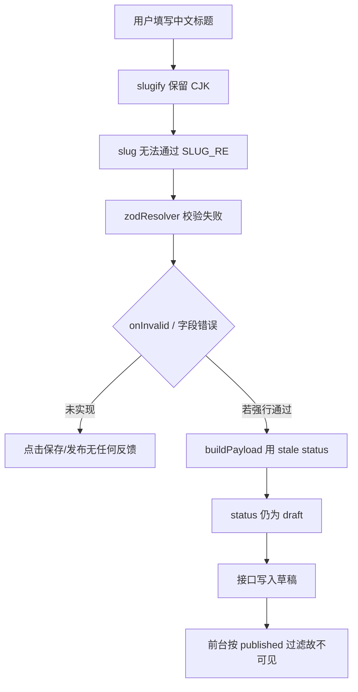

# Halo / Typecho 创建发布链路对照，与 taiping_blog 发布故障诊断

> 日期：2026-09（会话产出）  
> 对象：`ref/halo`、`ref/typecho`（官方仓库浅克隆）、当前 monorepo `taiping_blog`  
> 体例：结论旁标注 `路径:行号`；措辞采用「建议 / 倾向 / 通常」，避免绝对化断言。

---

## 0. 结论摘要

1. **Halo** 倾向「元数据 + Snapshot 指针 + 草稿/已发布双版本」模型，版本链与回收站较完整，但运行时偏重（K8s 式 Reconciler、JSON 文档存储）。
2. **Typecho** 倾向「单表多态 contents + type/status 双字段 + 表驱动路由」，体量轻、slug/URL 策略可配；版本历史较弱（仅单份工作修订），删除为物理删除。
3. **taiping_blog 面板已可用、发布链路却走不通**，更像是**前端提交被契约校验静默拦截 + 发布语义被状态覆盖**，而非后端路由或鉴权整体缺失。本地复现与代码路径均支持该判断。
4. 建议优先修复「slug 生成/校验一致性 + 表单错误可见 + 发布 status 传参」；版本控制与回收站可按 Halo/Typecho 的轻量取舍分阶段补齐。

---

## 1. Halo：文章全链路要点

### 1.1 技术栈与存储

| 项 | 现状 | 证据 |
|---|---|---|
| 栈 | Java 21 + Spring Boot WebFlux + R2DBC；前端 Vue 3 | `application/build.gradle`、`settings.gradle` |
| 物理表 | 倾向单表 `extensions(name, DATA JSON, version)` | `application/src/main/resources/schema-h2.sql:1-8` |
| Post 模型 | metadata + spec + status（K8s 风格） | `api/.../content/Post.java:33-72` |
| 正文 | 独立 Snapshot，Post 只存 `base/head/release` 三指针 | `Post.java:117-124`、`Snapshot.java:33-79` |

### 1.2 创建 / 草稿 / 预览 / 发布

- 草稿：`draftPost` 建 Post + Snapshot，phase=DRAFT（`PostServiceImpl.java:174-227`）。
- 已发布再编辑：若 `releaseSnapshot == headSnapshot` 则**新开 Snapshot**，避免覆盖线上内容（`PostServiceImpl.java:236-247`）。
- 预览：`GET /preview/posts/{name}?snapshotName=`（`PreviewRouterFunction.java:63-78`）。
- 发布：`spec.publish=true` 且 `releaseSnapshot=headSnapshot`；Reconciler 再派生 phase=PUBLISHED（`PostServiceImpl.java:285-292`、`PostReconciler.java:281-325`）。
- 可表达定时发布（`publishTime` + label `scheduling-publish`）。

### 1.3 删除

- **两段式**：`spec.deleted=true` 回收站 → 恢复用 JSON Patch → 物理删除走 Finalizer + GC。
- 物理删除时级联：Snapshot、评论、访问计数（`PostReconciler.java:349-361`）。
- 分类/标签实体不删，只重算 postCount。

### 1.4 版本与回退

- Snapshot 链 `parentSnapshotName`；base 存全文，其余存 line-diff JSON（`Snapshot.java:61-65`、`PatchUtils.java`）。
- 回退：`revertToSpecifiedSnapshot` 还原为**新草稿 Snapshot** 再 publish（`PostServiceImpl.java:309-330`）——行为上倾向「回退并发布」。
- 历史可列、可删（禁删 base / 当前 release）。

### 1.5 路由与 Slug

- 前台路由规则可配置（默认 `/archives/{slug}` 等），支持 `{name,slug,year,month,day,categorySlug}`（`SystemSetting.java:63-69`、`PostPermalinkPolicy.java:61-84`）。
- Slug 策略可配：标题音译 / 时间戳 / 短 UUID / UUID（`system-setting.yaml:80-93`）。
- **服务端唯一约束未见**，冲突处理偏前端查询 + 随机后缀（`PostSettingForm.vue:70-91` 留有 fixme）。
- 旧 slug 无 301 别名表。

---

## 2. Typecho：文章全链路要点

### 2.1 技术栈与存储

| 项 | 现状 | 证据 |
|---|---|---|
| 栈 | PHP + 自研 Router/Db/Widget | `index.php`、`var/Typecho/*` |
| 核心表 | `contents` / `fields` / `metas` / `relationships` / `comments` / `options` / `users` | `install/Mysql.sql` |
| 正文 | `contents.text` 与元数据同表；扩展走 `fields` EAV | `install/Mysql.sql:46-67,75-85` |
| 类型 | `type ∈ post|post_draft|page|page_draft|attachment|revision` | 同上 |
| 可见性 | `status ∈ publish|private|waiting|hidden` + `password` | `EditTrait.php:754-773` |

### 2.2 创建 / 草稿 / 预览 / 发布

- 表单 Action：`do=save|publish` → `writePost()`（`admin/write-post.php:64-71`、`Post/Edit.php:354-363`）。
- 新草稿：`type=post_draft`（`Post/Edit.php:97`）。
- **已发布文再存草稿**：写成 `type=revision` 且 `parent=原文 cid`，**一文仅保留一份**（`EditTrait.php:654-667`、查询 `limit(1)`）。
- 发布：丢弃 revision → update/insert 为 `type=post` → 同步分类标签与 fields（`EditTrait.php:571-633`）。
- 预览：`admin/preview.php` + `preview=1` 放宽 status 过滤（`Archive.php:616-647`）。

### 2.3 删除

- **物理删除**（无回收站）：`DELETE FROM contents`（`Base/Contents.php:293-296`）。
- `deletePost` 手工清理：分类/标签关系与 count、评论、附件 parent 解绑、revision、fields、空标签（`Post/Edit.php:236-302`）。
- 多步删除**未见事务包裹**，中途失败倾向留下脏关联。

### 2.4 版本与回退

- 仅「单份工作修订」，**无多版本历史 / 无回退 UI / 无 diff**。
- 发布时倾向直接丢弃该修订副本。

### 2.5 路由与 Slug

- 表驱动路由 + 占位符编译（`{cid} {slug} {year}...`）（`install.php:76-229`、`Router/Parser.php:91-114`）。
- 默认文章 URL 常为 `/archives/{cid}/`；可自定义 permalink。
- Slug：`Common::slugName` 规范化 + 冲突后缀 `-1/-2`；草稿用 `@` 前缀避开冲突（`Base/Contents.php:177-214`）。
- DB：`UNIQUE KEY slug`（全局）；中文标题 `\w+` 提取可能为空，回退 cid。

---

## 3. 创建发布全流程对照

```text
                Halo                         Typecho                    taiping_blog
创建草稿     draftPost + Snapshot          insert type=post_draft      POST /api/admin/posts
                                          (或 revision)               status=draft 入 posts
预览         /preview/posts/{name}         admin/preview.php           POST /api/admin/preview
                                          (整页 Archive)              (仅 markdown→html)
正式发布     spec.publish=true             type=post + status=publish  status=published
             releaseSnapshot=head          同步 metas/fields           updatePosts + mirror
已发布再改   新开 Snapshot                 写 revision(单份)           直接覆盖 content_md/html
版本回退     revert-content 有             无                          无
删除         回收站→物理删+级联            物理删+手工级联             物理删；post_terms FK CASCADE
Slug 唯一    偏前端查重（较弱）            UNIQUE(slug)+应用后缀       UNIQUE(slug)+应用查重
Slug 字符    音译/UUID 可配                [\w_-] + cid 兜底           slugify 保留 Unicode 字母
契约校验     OpenAPI Schema                表单/插件                   zod + react-hook-form
```

### 3.1 关键差异（与发布节点相关）

| 维度 | Halo | Typecho | 对 taiping_blog 的含义 |
|---|---|---|---|
| 草稿 ≠ 上线 | head/release 双指针 | type 后缀 | 现用 `status` 单字段即可，但前端必须把 status 正确送达 |
| 发布后编辑 | 新 Snapshot | 单份 revision | 现状直接覆盖，建议至少「发布后再存=覆盖线上」要有确认或草稿层 |
| 版本 | 完整链 + 回退 | 仅 1 份修订 | 若需要回退，建议自建 `post_revisions`，不必抄 Halo 的 diff 压缩 |
| 删除 | 逻辑删+GC | 物理删 | 现状物理删可接受；若要误删可恢复，可加 `deleted_at` |
| Slug | 可配策略，唯一性弱 | UNIQUE + 自动后缀 | 倾向采用 Typecho 思路：DB UNIQUE + 生成端与校验端同源 |
| 表单失败反馈 | 后端 ProblemDetail | 后台 Notice | **taiping 前端校验失败目前偏静默**，是发布「完全无感失败」的放大器 |

### 3.2 潜在问题点（两系统共有 / 单系统）

- 两系统均**未见** slug 变更后的 301 别名表，SEO 上旧链接倾向失效。
- Halo slug 唯一性偏弱；Typecho meta.slug 唯一性偏应用层。
- Typecho 删除无事务；Halo 异步 GC 对 Serverless 不友好。
- 发布「成功」的定义不一致：Halo 有 Reconciler 异步确认；Typecho 同步落库；taiping 设计文档还有 mirror 队列（失败不阻塞发布，见 `docs/architecture-design.md:162`）。

---

## 4. taiping_blog 发布故障诊断

### 4.1 现象与边界

- 现象：Studio 面板可进入、可编辑，但**保存 / 发布流程完全无法进行**。
- 边界：本次以静态代码路径 + 本地脚本复现为主；未在真实 Cloudflare Workers 运行时点火验证。鉴权、CSRF、路由挂载经阅读后倾向不是「全挂」主因（见 4.4）。

### 4.2 根因（按影响排序）

#### 根因 A：`slugify` 产物无法通过 `SLUG_RE`（中文站点高概率触发）

| 侧 | 规则 | 证据 |
|---|---|---|
| 生成 | 保留 Unicode 字母/数字，其余折为 `-` | `packages/shared-utils/src/slug.ts:4-11`（`\p{L}` 含 CJK） |
| 校验 | 仅 `[a-z0-9-]` | `packages/shared-utils/src/slug.ts:1`、`packages/content-model/src/post.ts:19-23` |

本地复现（与仓库实现一致）：

| 输入标题 | slugify 输出 | 是否通过 SLUG_RE |
|---|---|---|
| `Hello World 你好` | `hello-world-你好` | 否 |
| `太皮博客发布流程` | `太皮博客发布流程` | 否 |
| `你好` | `你好` | 否 |
| `My Post` | `my-post` | 是 |

对中文博客而言，标题自动生成 slug 是默认路径（`PostEditPage.tsx:143-149`），**几乎每次都会产出非法 slug**，`postInputSchema` 直接 `safeParse` 失败。

设计文档其实写明 slug 倾向 ASCII（`docs/technical-design.md:226` `^[a-z0-9-]+$`），与运行时 `slugify` 未对齐——契约与实现分叉。

#### 根因 B：表单校验失败静默，用户无反馈

- `handleSave` / `handlePublish` 均只挂 `form.handleSubmit(onValid)`，**未提供 `onInvalid`**（`apps/studio/src/pages/PostEditPage.tsx:197-206`）。
- 全 studio **未见** `formState.errors` / 字段错误渲染（Grep 零命中）。
- 结果：点「保存」「发布」→ zod 失败 → **不发请求、无 Toast、无红字**，观感即「发布流程完全无法进行」。

这与根因 A 叠加后，表现会非常像「按钮没反应」。

#### 根因 C：「发布」把 status 又写回 stale state

```text
handlePublish:
  setStatus('published')          // React 异步，本帧仍是 'draft'
  buildPayload({ ...values, status: 'published' })
    → { ...values, type, status } // status 被闭包里的 state（draft）覆盖
```

证据：`PostEditPage.tsx:159-167`、`:201-206`。  
本地模拟结果：`payload.status = draft`。

即使根因 A/B 被绕过（例如手输 ASCII slug），点「发布」仍可能落成草稿，前台不可见——第二层「发布了却看不到」。

### 4.3 次要风险（未必阻断首次保存，但影响发布质量）

| 级别 | 问题 | 证据 |
|---|---|---|
| M | 无版本/回退；已发布文直接覆盖 `content_md` | `posts.ts:240-305`；对比 Halo Snapshot / Typecho revision |
| M | `deletePost` 物理删；`post_terms` 靠 FK CASCADE，孤儿 `terms` 可能残留 | `posts.ts:307-314`、`0001_init.sql:54-60` |
| M | slug 冲突仅应用层查重；`UNIQUE(slug)` 全局唯一，与代码按 `type` 查重语义不完全一致 | `0001_init.sql:6` vs `posts.ts:183-186` |
| L | 设计中的「发布独立端点」存在（`POST /posts/:id/publish`），但 UI 发布走的是 create/update + status，两套语义并存 | `admin.ts:319-327` vs `PostEditPage` handlePublish |
| L | `publishedAt` 走 `z.string().datetime()`，依赖 `toIso` 产出带 Z 的 ISO；draft 时空值可过，发布时由 `toISOString()` 兜底 | `post.ts:53`、`datetime.ts:6-11`、`PostEditPage.tsx:163-166` |
| L | GitHub 镜像二次更新缺 `sha`，易 409（审查报告已记） | `reviews/06-admin-launch-readiness.md` R1 |

### 4.4 倾向可排除的主因（仍建议联调确认）

| 假设 | 判断 | 依据 |
|---|---|---|
| 鉴权中间件挡住登录/公开路径 | 倾向否 | 白名单含 login/bootstrap/register/reset（`middleware/auth.ts:10-19`） |
| 前端未带 CSRF 头 | 倾向否 | `client.ts:46-48` 非 GET 自动加 `X-Requested-With` |
| 后台路由未挂载 | 倾向否 | `index.ts:50` `app.route('/api/admin', adminRoutes)`；posts CRUD 齐全（`admin.ts:277-327`） |
| 预览接口缺失 | 否 | `POST /api/admin/preview` 已实现（`admin.ts:588-606`） |

### 4.5 故障链路示意



---

## 5. 解决方案建议

> 优先修「能发出合法请求」；再补「发布语义正确」；最后考虑版本/回收站。下列方案可独立验收。

### 5.1 P0：打通提交（建议 1–2 天内）

**方案一（推荐）：生成端与校验端同源，slug 只允许 URL 安全字符**

1. 重写 `slugify`：非 `[a-z0-9]` 一律折为 `-`；空结果回退 `post-<shortId>`（可参考 Typecho 的 cid 兜底，但用短随机 id 更合适 Worker）。
2. 中文标题可选「拼音/音译」子集（Halo 的 generateByTitle 精简版），或直接短 UUID，避免引入重型 transliteration。
3. 保持 `SLUG_RE` / schema 引用同一常量（呼应 `reviews/08` C-02）。
4. `PostEditPage` 的 `handleSubmit(..., onInvalid)` 中 Toast 出第一条错误；slug/title 输入下展示 `form.formState.errors`。

- 利：根治中文站点默认路径；与设计文档 ASCII slug 一致。  
- 弊：若历史数据已存 CJK slug，需一次性迁移或放宽校验（见方案二）。

**方案二：放宽 `SLUG_RE` 允许 Unicode 字母**

1. 将校验改为「非空白、非 `/ ? #` 等 URL 保留字」，或允许 `\p{L}\p{N}-`。  
2. 前台路由对 slug 做 `encodeURIComponent`。

- 利：兼容中文路径美学，改动面小。  
- 弊：与现有文档/部分索引假设不一致；复制链接、CDN、sitemap 对非 ASCII 路径兼容成本略高。

**无论选哪条，都建议同步做：**

- `buildPayload` 不要读 React state 的 `status`，以参数传入目标 status（修复根因 C）：

```ts
const buildPayload = (values: PostInput, nextStatus: 'draft' | 'published'): PostInput => ({
  ...values,
  type: contentType,
  status: nextStatus,
  publishedAt:
    nextStatus === 'published'
      ? toIso(values.publishedAt) ?? new Date().toISOString()
      : toIso(values.publishedAt),
})
```

- `handlePublish` 改为 `save.mutate(buildPayload(values, 'published'))`，避免 `setStatus` 竞态。

### 5.2 P1：发布语义与反馈

| 项 | 建议 | 参照 |
|---|---|---|
| 发布成功判定 | 以服务端返回的 `status === 'published'` 为准刷新徽章；失败保留表单 | 说说模块已有「失败保留 draft」设计可复用 |
| 草稿/发布按钮 | 「保存」固定 draft，「发布」固定 published；侧栏 status 仅作默认值 | 减少双入口语义漂移 |
| 冲突 | slug 重复返回 409 时，自动生成后缀重试一次或引导手改 | Typecho `-1/-2`；Halo 短随机后缀 |
| 用例 | 补 Vitest：中文标题→可提交 payload；publish payload.status 恒为 published | 先写用例再改 |

### 5.3 P2：版本 / 删除（按需）

| 能力 | 轻量建议 | 慎抄 |
|---|---|---|
| 版本 | `post_revisions(id, post_id, content_md, created_at, author)`，发布/更新时追加一行；回退=复制旧行到 posts | Halo line-diff Snapshot 链（复杂度高） |
| 回收站 | `posts.deleted_at` + 列表过滤；永久删除再清 revisions/comments | Halo Finalizer/GC 异步删除 |
| 删除级联 | D1 batch 事务：posts + post_terms + comments(target=post) + revisions | Typecho 无事务多步删除 |

### 5.4 验收清单（建议）

- [ ] 中文标题新建 → 自动生成合法 slug → 保存草稿成功，列表可见  
- [ ] 点「发布」→ 返回 status=published → 前台 `/posts/:slug` 可访问  
- [ ] 故意提交非法 slug → 表单红字 + Toast，**不会**静默无响应  
- [ ] 发布后改稿再保存 → 明确是覆盖线上或进入草稿（按产品选择断言）  
- [ ] slug 冲突 → 409 文案可读，可改后重试  
- [ ] 删除文章 → 关联评论/关系不残留（抽查 terms 空标签策略）

---

## 6. 对当前架构的取舍建议（结合两系统）

| 主题 | 倾向 | 理由 |
|---|---|---|
| 存储 | 维持 D1 关系表，**不**抄 Halo 单表 JSON extensions | 列表/过滤/索引更直接，符合 Worker+D1 |
| 发布状态 | 维持 draft/published 两态起步；若要审核/定时再扩展 status 或加字段 | Typecho 四态/Halo phase 对个人博客偏重 |
| Slug | **采用 Typecho 的 UNIQUE + 自动后缀**，生成策略可配置（Halo 思想） | 比 Halo 前端查重更稳 |
| 版本 | 若需要，自建 revision 表；整篇快照即可 | 优于 Typecho 单副本，轻于 Halo diff 链 |
| 路由 | 维持固定少量路由（`/posts/:slug` 等） | 两系统的可配置 permalink 可后置 |
| 删除 | 先物理删+级联事务；误删需求出现再上回收站 | 变更最小化 |

---

## 7. 附录

### 7.1 本仓库关键证据

| 主题 | 位置 |
|---|---|
| slug 生成/校验 | `packages/shared-utils/src/slug.ts` |
| 文章契约 | `packages/content-model/src/post.ts` |
| 保存/发布 UI | `apps/studio/src/pages/PostEditPage.tsx` |
| HTTP/CSRF | `apps/studio/src/api/client.ts`、`apps/edge/src/middleware/auth.ts` |
| 服务层 CRUD | `apps/edge/src/services/posts.ts` |
| 表结构 | `apps/edge/migrations/0001_init.sql` |
| 路由挂载 | `apps/edge/src/index.ts`、`apps/edge/src/routes/admin.ts` |

### 7.2 开源仓库

- Halo：`ref/halo`（github.com/halo-dev/halo 浅克隆）
- Typecho：`ref/typecho`（github.com/typecho/typecho 浅克隆）

详细模块摘录见会话分析笔记（Halo / Typecho 各一份），与本文第 1–2 节同源。

### 7.3 复现命令摘要

```text
slugify('你好')           => '你好'        SLUG_RE=false
slugify('太皮博客发布流程') => '太皮博客发布流程' SLUG_RE=false
slugify('My Post')        => 'my-post'     SLUG_RE=true
buildPayload(..., status='draft') 覆盖 status: 'published' => 实际 draft
```
